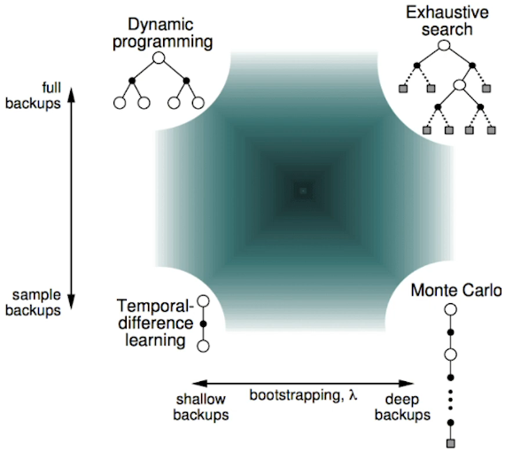
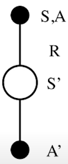
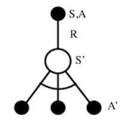
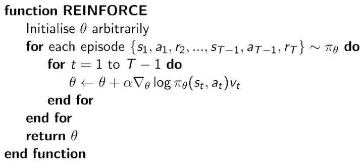
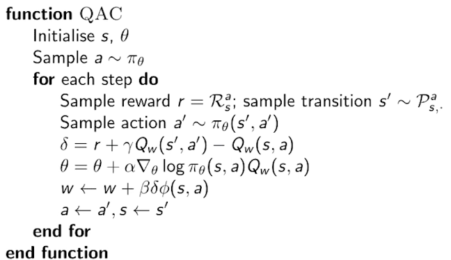
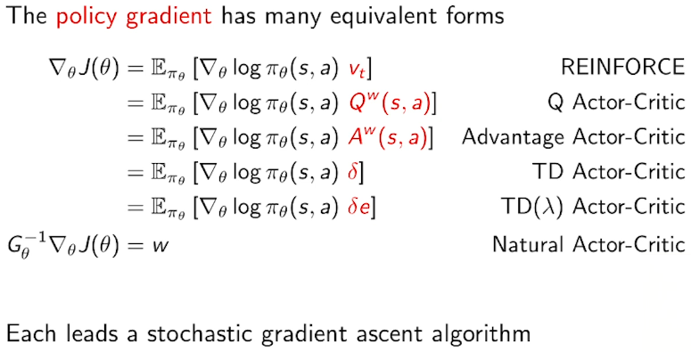

# Model-Based
- Dynamic Programming: Dynamic sequential + Optimized programming
  - Property: Decompsed into subproblems, Subproblems recur many times
  - Markov Devision Processes satisfy both properties
  - Assume full knowledge of the MDF
  - i.e. Model is known
    - Transition probablilty, Reward are known
    - Full Width Back-up
## Prediction: Policy Evaluation
  - Policy $\pi$ is given → Evaluate policy
    - $$v_{k+1} = \sum_{a\in A} \pi(a|s)\left (R_s^a+\gamma\sum_{s'\in S}P_{ss'}^av_k(s')\right)$$: Bellman Expectaton Equation
## Control: Policy Iteration
  - Policy $\pi$ is given → Evaluate policy → Improve policy 
    - $$\pi'=greedy(v_\pi)$$: Greedy Policy Improvement
  - Iteration
    - (→ Evaluate policy → Improve policy → Evaluate policy → Improve policy → Evaluate policy → Improve policy)
  - If improvements stop
    - $$q_{\pi} (s,\pi'(s))=\max_{a\in A} q_\pi(s,a)=q_\pi(s, \pi(s)) = v_\pi(s)$$
      - $q_\pi(s,a)$: 상태 s에서 행동 a를 선택했을 때의 행동 가치 함수(Action-Value Function), 현재 정책을 따른 결과
      - 현재 정책 π로 얻은 q값 중 가장 높은 행동을 선택하여 새로운 정책 π'를 만듦. 즉, 정책 개선
      - $q_{\pi} (s,\pi'(s))$: 새로운 정책의 결과가 이전 정책의 결과와 같다면 최정 정책에 도달함
      - 이 때의 상태 가치 $v_\pi(s)$는 정책 π 하에서 최정 행동을 취했을 때 기대되는 가치
    - Bellman optimality eqation has been satisfied
      - $$v_\pi(s) = \max_{a\in A} q_\pi(s,a)$$
    - Therefore $v_\pi(s)=v_*(s)$ for all $s\in S$ (*는 optimal의 의미)
    - **So $\pi$ is an optimal policy**
## Control: Value Iteration
  - Principle of Optimality
    - $\pi$ achieves the optimal value from state s'
    - $v_\pi(s') = v_*(s')$, $s'\in S$
  - Update iteratively
    - $$v_*(s)\larr \max_{a\in A} R_s^a+\gamma\sum_{s'\in S}P_{ss'}^av_*(s')$$: Bellman Optimality Equation
  - No explicit policy
  - But, 최종적으로 V(s)가 수렴한 뒤 greedy하게 policy를 추출
  - Policy Iteration (Evaluation → Improvement) 을 하지 않아도, V(s)를 반복적으로 업데이트 하면서 implicit하게 정책 개선이 이루어짐
# Model-Free (with Lookup Table)
- P(s'|s,a)를 모른다
- R(s,a,s')를 모른다
- Lookup Table: 상태(또는 상태-행동 쌍)의 value를 명시적으로 테이블에 저장하여, 상태 s가 주어졌을 때 V(s)를 테이블에서 바로 찾아서 이용하는 방식
## Prediction: Policy Evaluation
### Monte-Carlo Learning
- Learn from complete episodes: no bootstrapping
- policy $\pi$ is given
- Update V(s) incrementally after each episode
  - $$V(S_t) \larr V(S_t)+\alpha(G_t-V(S_t))$$
  : 현재 상태의 Value와 오차(총 Return-현재 상태 Value)에 학습률(alpha)를 곱한 결과를 더한 것으로 현재 상태의 Value를 업데이트 함 (t+1이 아닌 t 시점의 value를 업데이트 하는 것)
  : 이 때 총 Return 인 $G_t$는 에피소드가 끝난 후 누적 보상을 사용
- Unbiased, High Variance(dependent on many random actions, transition, rewards)
- Non-Markov property
### TD Learning
- Learn from incomplete episodes, by bootstrapping
- policy $\pi$ is given
- Update a guess towards a guess (estimated return)
  - $$V(S_t) \larr V(S_t)+\alpha(R_{t+1}+\gamma V(S_{t+1})-V(S_t))$$
  : "한 스텝 후의 가치"를 이용해서 현재 가치 추정치를 업데이트
  - TD target: $R_{t+1}+\gamma V(S_{t+1})$
  - TD error: $\delta_t=R_{t+1}+\gamma V(S_{t+1})-V(S_t)$
- Biased, Low Variance(dependent on one random actions, transition, rewards)
- Markov property
- Forward View TD(λ)
  - n-step Return을 가중 평균하여 Target을 만드는 방식
  - λ(람다)를 통해 1-step, 2-step, ..., n-step Return을 가중합으로 섞어 최종 Return을 계산.
  - $$G_t^\lambda=(1-\lambda)\sum_{n=1}^\infin \lambda^{n-1}G_t^{(n)}$$  
- Backward View TD($\lambda $)
  - $$V(S_t) \larr V(S_t)+\alpha \delta_t E_t(s)$$
  - Eligibility Trace를 활용해 과거 상태들의 책임(책임 추적)을 분배하며 업데이트하는 방식
  - $E_t(s)$: Eligibility Trace
    - Frequency heuristic + Recency heuristic
    - 과거에 얼마나 자주, 얼마나 최근에 방문했는지에 따른 credit
  - TD(1) = MC
    - credit is deffered until end of episode

## Control: Policy Iteration
- Greedy policy improvement over V(s) requires model of MDP
- But, greedy policy improvement over Q(s,a) is model-free
  - $$\pi'(s)=\argmax_{a\in A} Q(s,a)$$
- $\epsilon$-Greedy Exploration
  - $$\pi(a|s)=\begin{cases}\frac{\epsilon}{m} + 1 - \epsilon & \text{if } a^* = \arg\max\limits_{a \in \mathcal{A}} Q(s, a) \\ \frac{\epsilon}{m} & \text{otherwise} \end{cases}$$
  - All m actions are tried with non-zero probability
- Greedy in the Limit with Infinite Exploration (GLIE) should be satisfied
  - All state-action pairs are explored inifinitely many times
    - $$\lim_{k\rarr \infin} N_k(s,a) = \infin$$
  - The policy converges on a greedy policy
    - $$\lim_{k\rarr \infin} \pi_k(a|s)=1(a=\argmax_{a'\in A} Q_k(s,a'))$$
    - 결국 Optimal Policy 가 탄생한다.
  - $\epsilon$-greedy에서 $\epsilon_k = {1\over k}$ 일 때, $\epsilon$가 0에 수렴하여 가장 greedy한 policy 가 탄생한다.
### On-Policy Learning
- 에이전트가 현재 학습 중인 정책으로 직접 행동을 선택하고, 그 정책을 개선하는 방식
#### GLIE MC Control
  - Sample $k$th episode using $\pi$
    - $N(S_t, A_t) \larr N(S_t, A_t)+1$: 상태(S), 행동(A) 쌍에 대한 Count
    - $Q(S_t. A_t) \larr Q(S_t, A_t)+ {1 \over N(S_t, A_t)}(G_t-Q(S_t,A_t))$
    : ${1 \over N(S_t, A_t)}$ 는 방문 횟수에 따른 학습률
  - Improve policy
    - $\epsilon \larr {1\over k}$
    - $\pi \larr$ $\epsilon$-greedy(Q)
  - Converge to the optimal action-value function
    - $Q(s,a) \rarr q_*(s,a)$
#### TD Control: Sarsa
  - 
  - $Q(S,A) \larr Q(S,A)+\alpha(R+\gamma Q(S',A')-Q(S,A))$
#### n-step Sarsa
  - n-step Q-return
    - $$q_t^{(n)}=R_{t+1} + \gamma R_{t+2} +...+\gamma ^{n-1}R_{t+n}+\gamma ^n Q(S_{t+n})$$
  - Update Q(s,a)
    - $$Q(S_t,A_t) \larr Q(S_t,A_t)+\alpha(q_t^{(n)}-Q(S_t,A_t))$$
#### Forward View Sarsa(λ), Backward View Sarsa(λ)
### Off-Policy Learning
- 데이터를 수집하는 정책(행동 정책)과 학습하는 대상 정책(평가 정책)이 서로 다른 방식
- Evaluate target policy $\pi(a|s)$ to compute $v_\pi (s)$ or $q_\pi (s,a) $
- While following behaviour policy $\mu (a|s)$
- Estimate the expectation of a different distribution
  - $$E_{X \sim P}[f(X)]=\sum P(X)f(X) = \sum Q(X){P(X)\over Q(X)}f(X)=E_{X\sim Q}\left[{P(X)\over Q(X)}f(X)\right]$$
  - 우리는 확률 분포 P(X)에 대해 어떤 함수 f(X)의 평균을 구하고 싶다
  - 그런데 P(X)의 확률이 극히 드물어 샘플링이 어렵다
  - 이 때, Q(X)의 확률 분포는 샘플링이 쉽다면
  - 샘플링이 쉬운 Q(X)에서 데이터를 뽑고, P/Q로 확률비를 보정하여 P에서 결과를 추정할 수 있다.
#### MC Control
- Use returns generated from μ to evaluate π
- Weight return $G_t$ according to similarity between policies
- Multiply importance sampling corrections along whole episode
  - $$G_t^{\pi/\mu}={\pi(A_t|S_t) \over \mu(A_t|S_t)}{\pi(A_{t+1}|S_{t+1}) \over \mu(A_{t+1}|S_{t+1})}{...}{\pi(A_T|S_T) \over \mu(A_T|S_T)}G_t$$
- Update value towards corrected return
  - $$V(S_t) \larr V(S_t)+\alpha(G_t^{\pi/\mu}-V(S_t))$$
#### TD Control: Q-Learning
- No importance sampling is required
- Next action is chosen using behaviour policy $A_{t+1} \sim \mu(\cdot|S_t)$
  - 환경과 상호작용에 필요, 하지만 업데이트에는 쓰이지 않음
- But we consider alternative successor action $A'\sim \pi(\cdot|S_t)$
  - 학습(업데이트)에 사용되는 대체 행동, target policy 기준
- Update $Q(S_t,A_t)$ towards value of alternative action
  - $$Q(S_t,A_t) \larr Q(S_t,A_t)+\alpha(R_{t+1}+\gamma Q(S_{t+1},A')-Q(S_t,A_t))$$
- Improve taget policy π (which is greedy)
  - $\pi(S_{t+1})=\argmax_{a'}Q(S_{t+1},a')$
  - While, behaviour policy μ is e.g. ε-greedy
  - Then, Q-learning target is simplified
    - $$R_{t+1} + \gamma Q(S_{t+1}, A')=R_{t+1} + \gamma Q(S_{t+1}, \argmax _{a'}Q(S_{t+1},a'))=R_{t+1} + \max_{a'}\gamma Q(S_{t+1}, A')$$
  - 

# Function Approximation
- Why?
  - State/Action 공간이 너무 커서 Table Lookup이 불가능해진다.
  - 일반화나 고차원 환경에서 효율적인 학습을 하려면 테이블 접근법이 아닌 Neural Network 방식을 이용해야 함
- Estimate value function
  - $\hat{v}(s,w) \approx v_{\pi}(s)$
  - $\hat{q}(s,a,w) \approx q_{\pi}(s,a)$
- Goal
  - $J(w) = \mathbb{E}_\pi \left[ \left( v_\pi(S) - \hat{v}(S, \mathbf{w}) \right)^2 \right]$
- Gradient Descent
  - 전체 데이터 대상 파라미터 업데이트
    - $\Delta \mathbf{w} = -\frac{1}{2} \alpha \nabla_{\mathbf{w}} J(\mathbf{w}) = \alpha \, \mathbb{E}_\pi \left[ \left( v_\pi(S) - \hat{v}(S, \mathbf{w}) \right) \nabla_{\mathbf{w}} \hat{v}(S, \mathbf{w}) \right]$
  - 샘플 데이터 대상 (Stochastic) 파라미터 업데이트
    - 샘플 하나를 이용한 업데이트
      - 한 번 방문한 샘플만으로도 가중치를 조금씩 조정하기 때문에 연속적이고 빠르게 업데이트할 수 있음
    - $\Delta \mathbf{w} = \alpha \left[ \left( v_\pi(S) - \hat{v}(S, \mathbf{w}) \right) \nabla_{\mathbf{w}} \hat{v}(S, \mathbf{w}) \right]$
- If, $\hat{v}(S,w)=x(S)^{\top}w$ 
  - $J(\mathbf{w}) = \mathbb{E}_\pi \left[ \left( v_\pi(S) - \mathbf{x}(S)^\top \mathbf{w} \right)^2 \right]$
  - $\Delta w=\alpha(v_{\pi}(S)-\hat{v}(S,w))x(S)$
## State Value Function Gradient
- MC
  - $\Delta w=\alpha(G_t-\hat{v}(S,w))\nabla_w\hat{v}(S_t,w)$
  - $=\alpha(G_t-\hat{v}(S,w))x(S_t)$
- TD
  - TD(0)
    - $\Delta w=\alpha(R_{t+1}-\lambda\hat{v}(S_{t+1},w)-\hat{v}(S_t,w))\nabla_w\hat{v}(S_t,w)$
    - $=\alpha\delta x(S)$
  - TD(λ)
    - $\Delta w=\alpha(G_t^λ-\hat{v}(S_t,w))\nabla_w\hat{v}(S_t,w)$

## Action Value Function Gradient
- MC
  - $\Delta w=\alpha(G_t-\hat{q}(S_t,A_t,w))\nabla_w\hat{q}(S_t,A_t,w)$
- TD
  - TD(0)
    - $\Delta w=\alpha(R_{t+1}-\lambda\hat{q}(S_{t+1},A_{t+1},w)-\hat{q}(S_t,A_t,w))\nabla_w\hat{q}(S_t,A_t,w)$
  - TD(λ)
    - Forward View:
      - $\Delta w=\alpha(q_t^λ-\hat{q}(S_t,A_t,w))\nabla_w\hat{q}(S_t,A_t,w)$
    - Backward View: 
      - $\Delta w=\alpha \delta_t E_t$
## Batch Methods
- Experience D consisting of <state, value> pairs
  - $D=\left \{<s_1,v_1^{\pi}>,<s_2,v_2^{\pi}>,...,<s_T,v_T^{\pi}> \right \}$
  - $LS(w)=\sum_{t=1}^T(v_t^{\pi}-\hat{v}(s_t,w))^2 = \mathbb{E}_D \left [ (v^{\pi}-\hat{v}(s,w))\right ]$
- Stochastic Gradient Descent
  1. Sample state, value from experience
    $$<s,v^{\pi}> \sim D$$
  2. Apply stochastic gradient descent update
    $$\Delta w=\alpha (v^{\pi}-\hat{v}(s,w))\nabla_w\hat{v}(s,w)$$
- Batch Methods의 목적
  - 데이터 효율성 (Sample Efficiency) 향상
    - 온라인 방식(online methods)은 하나의 경험 (s, a, r, s')를 수집하자마자 업데이트합니다.
    - 하지만 배치(batch) 방식은 여러 경험을 모아서 한 번에 학습하므로, 동일한 데이터를 여러 번 재활용할 수 있고 샘플 효율이 높아집니다.
    - 특히 환경 상호작용 비용이 큰 경우(예: 실제 로봇 제어)에는 매우 중요
  - Variance 감소 및 안정성 향상
    - 단일 샘플 업데이트는 노이즈가 심하고 불안정할 수 있습니다.
    - 배치 방식은 다수 샘플의 평균을 기반으로 그라디언트를 계산하므로, 업데이트가 더 안정적이고 variance가 줄어듭니다.
    - 이는 특히 function approximation에서 **값이 발산하는 문제(divergence)**를 줄여줍니다.

### Deep Q-Networks (DQN)
- DQN = Experience Replay + Fixed Q-Targets
- 왜 DQN이 필요한가?
  - Q-Learning은 모든 (State, Action) 쌍을 테이블로 저장하는 방식인데,
    - 상태 공간이 크거나 연속적인 경우 (예: 이미지 입력) 테이블을 만들 수 없습니다.
  - 그래서 Q(s, a)를 Neural Network로 근사(Function Approximation) 하는 방법이 필요합니다.
    - DQN은 Q(s, a; θ)를 학습하는 Neural Network Q-Function Approximation 방식입니다.
1. Take action $a_t$ according to ε-greedy policy
   1. 현재 상태 S에서 ε-greedy policy로 행동 a 선택 
2. Store transition $(s_t,a_t,r_{t+1},s_{t+1})$ in replay memory D
   1. 환경과 상호작용하여 (S, a, r, S') 경험을 얻고, Replay Buffer에 저장
3. Sample random mini-batch of transitions $(s,a,r,s')$ from D
   1. Replay Buffer에서 무작위로 Minibatch 샘플링
4. Compute Q-learning targets w.r.t. old, fixed parameters $w^-$
5. Optimise MSE between Q-network and Q-learning targets
$$L_i(w_i)=\mathbb{E}_s,a,r,s' \sim D_i \left [ \left ( r + \gamma \max_{a'} Q(s',a';w_i^-)-Q(s,a;w) \right )\right ]$$

1. Using variant of stochastic gradient descent
   1. $w$ 업데이트: 매 학습 스텝마다 미니배치 데이터를 사용해 SGD로 업데이트
   2. $w^-$ 업데이트: 학습이 불안정해지는 것을 막기 위해, 즉, 직접 역전파로 학습하지 않고, w의 값을 복사/혼합해서 갱신
      1. Hard update: 일정 주기마다 $w^- \larr w$
      2. Soft update: 타깃 네트워크를 조금씩 현재 네트워크로 이동 ($w^- \larr \gamma w+(1-\gamma)w^-$)

# Policy Gradient
- Parametrise the policy
$$\pi_{\theta} (s,a)=\mathbb{P}[s|a,\theta]$$
- **Expected Return(기대 보상)**을 최대화하는 파라미터 θ를 찾는 것 → Gradient Ascent (기울기 상승)
- Search for a local maximum in $J(\theta)$ by ascending the gradient of the policy
  - $\Delta \theta=\alpha \nabla_{\theta}J(\theta)$
  - Policy Gradient is 
    - $$\nabla_\theta J(\theta) = \begin{pmatrix}\frac{\partial J(\theta)}{\partial \theta_1} \\\vdots \\\frac{\partial J(\theta)}{\partial \theta_n}\end{pmatrix}$$
## Policy Objective Functions
### Goal: Find the best $\theta$
- Episodic Environments: use start value
  -  $J_i(\theta)=V^{\pi_{\theta}}(s_1)=\mathbb{E}_{\pi_{\theta}}[v_1]$
- Continuing Environments
  - Use average value
    - $J_{av}v(\theta)=\sum_s d^{\pi_{\theta}}(s)V^{\pi_{\theta}}(s)$
  - Use average reward per time-step
    - $J_{av}v(\theta)=\sum_s d^{\pi_{\theta}}(s) \sum \pi_{\theta}(s,a)R_s^a$
  - $d^{\pi_{\theta}}$: Stationary Distribution of Markov Chain
    - 정착 분포: 어떤 상태에 얼마나 자주 머무는가 → 일종의 가중치 역할
### One-Step MDP
  - Starting in state s ~ d(s)
  - Terminating after one time-step with reward r
  - $J(\theta)=\mathbb{E}_{\pi_{\theta}}[r]=\sum_{s \in S}d(s)\sum_{a \in A}\pi_{\theta}(s,a)R_{s,a}$
  - $\nabla_{\theta}J(\theta)=\sum_{s \in S}d(s)\sum_{a \in A}\pi_{\theta}(s,a)\nabla_{\theta}\log \pi_{\theta}(s,a)R_{s,a}$
    - $=\mathbb{E}_{\pi_{\theta}}[\nabla_{\theta}\log \pi_{\theta}(s,a)r]$
### Softmax Policy
  - $$\pi_\theta(s, a) = \frac{e^{\phi(s, a)^T \theta}}{\sum_{a'} e^{\phi(s, a')^T \theta}}$$
  - $$\nabla_\theta \log \pi_\theta(s,a)= \phi(s,a)-\mathbb{E}_{\pi_\theta}[\phi(s,\cdot)]$$
### Policy Gradient Theorem, multi-step MDPs
  - Replace instantaneous reward $r$ with long-term value $Q^{\pi_\theta}(s,a)$
  - $$\nabla_{\theta}J(\theta)=\mathbb{E}_{\pi_{\theta}}[\nabla_{\theta}\log \pi_{\theta}(s,a)Q^{\pi_\theta}(s,a)]$$
### MC Policy Gradient (REINFORCE)
- Update parameters by stochastic gradient ascent
- Use return $v_t$ as an unbiased sample of $Q^{\pi\theta}(s_t,a_t)$
  - $$\Delta\theta=\alpha\nabla_{\theta}\log \pi_{\theta}(s_t,a_t)v_t$$

## Actor-Critic Policy Gradient
- Monte-Carlo policy gradient still has high variance
- Use critic to estimate the action-value function
  - $$Q_w(s,a)\approx Q^{\pi_\theta}(s,a)$$
### Actor-Critic Algorithms
- Critic
  - 상태 가치 V 또는 행동 가치 Q를 이용해 Actor가 얼마나 좋은 행동을 했는지 평가
  - Action value fuction approximation
    - $Q_w(s,a)=\phi(s,a)^\top w$
  - Update action-value function parameters $w$ by linear TD(0)
- Actor
  - Update policy parameters $\theta$, in direction suggested by critic
- Follow an approximate policy gradient
  - $$\nabla_\theta J(\theta) \approx \mathbb{E}_{\pi\theta}[\nabla_{\theta}\log \pi_{\theta}(s,a)Q_w(s,a)]$$
  - $$\Delta\theta=\alpha\nabla_{\theta}\log \pi_{\theta}(s,a)Q_w(s,a)$$

###

### What is Advantage?
- Advantage는 “평균보다 얼마나 나았는가”를 알려줌
  - 보상의 절대 크기보다는 상대적 우수성만 반영하므로 학습이 안정됨
- $A(s,a)=Q(s,a)-V(s)$
  - Q: 상태 s에서 행동 a를 한 후 얻을 수 있는 예상 가치
  - V: 상태 s에서 평균적으로 기대되는 가치
  - A > 0: 평균보다 좋은 행동
  - A < 0: 평균보다 나쁜 행동
- V는 Baseline의 역할을 하며, 보상의 편차를 줄여 variance를 감소시키고, gradient 추적을 안정화한다.
  - baseline을 빼도 기댓값은 유지되기 때문에, bias는 없음

## PPO (Proximal Policy Optimization)
- 목표
  - 좋은 행동은 더 자주 하게 하고, 나쁜 행동은 덜 하게 하자.
  - 단, **"정책이 너무 크게 변하지 않도록 천천히 학습"**하는게 PPO의 핵심
    - 정책의 성능을 평가할 때 Advantage를 사용
    - 정책 업데이트를 “너무 많이” 하지 않도록 제한
  - Actor-Critic에서는 정책 분포가 한 스텝으로 크게 변화될 수 있음
    - $\nabla_{\theta} J(\theta) = \mathbb{E} \left[ \nabla_{\theta} \log \pi_{\theta}(a_t \mid s_t) \cdot \hat{A}_t \right]$
    - 현재 정책 $\pi_{\theta}$ 자체를 사용하기 때문에 한 번의 gradient step이 크다면
    - 이전에 학습한 정책 분포와 차이가 너무 커짐
    - 그 결과 variance가 커지고 성능이 떨어질 수 있음
  - 그래서 PPO는 확률 비율 $r$을 사용하면서, 변화 폭이 너무 크면 클리핑으로 제한
    - 이전 정책 대비 확률비율을 사용하게 되면, 예를 들어 이전에 많이 올렸을면 이번에는 일정 비율로만 올라감
- Objective Function (목적함수)
$$L^{\text{CLIP}}(\theta) = \mathbb{E}_t \left[ \min \left( r_t(\theta) \hat{A}_t,\ \text{clip}(r_t(\theta),\ 1 - \epsilon,\ 1 + \epsilon)\ \hat{A}_t \right) \right]$$
  - min: 가능한 목적함수를 작게 만들려고 함
  - $r_t(\theta) = \frac{\pi_\theta(a_t \mid s_t)}{\pi_{\theta_{\text{old}}}(a_t \mid s_t)}$: 새로운 정책이 예전보다 행동 $a_t$를 더 자주/덜 자주 선택하는 비율
    - $a_t > 1$: 더 자주 선택
    - $a_t < 1$: 덜 자주 선택
  - $\hat{A_t}$: Advantage function
    - 이 행동이 얼마나 좋은지
    - 종류
      - MC: $A_t = R_t-V(S_t)$
      - TD(0): $A_t=\delta_t=r_t+\gamma V(s_{t+1})-V(s_t)$
      - GAE (Generalized Advantage Estimation): $A_t=\sum_{l=0}^{\infin}(\gamma \lambda)^l \delta_{t+1}$
  - ϵ: 정책이 바뀌는 정도를 제한하는 하이퍼파라미터 (예: 0.2)
  - Clip
    - 값을 일정 범위 내로 제한(clipping)하는 함수
    - $$\text{clip}(x, a, b) = \begin{cases}a & \text{if } x < a \\x & \text{if } a \le x \le b \\b & \text{if } x > b\end{cases}$$
    - 여기서의 역할
      - $r_t$가 1보다 크면: 행동을 더 자주 선택하게 만듦
      - $r_t$가 1보다 작으면: 행동 확률을 줄임
    - → 안정적인 학습!
- 전체 손실 함수
$$L=L^{CLIP}(\theta)-c_1\cdot L^{VF}+c_2 \cdot S[\pi_\theta]$$
  - $L^{VF}$: 상태 가치 손실 함수 (MSE)
  - $S[\pi_\theta]$: 엔트로피 보너스 (탐색성 유지)
  - $c_1$, $c_2$: 가중치 하이퍼파라미터
- PPO 학습 루프 요약
  1. 여러 에피소드 동안 정책에 따라 환경에서 행동
  2. 경험을 모아서 Advantage 계산 (GAE)
  3. 정책과 가치함수 네트워크를 minibatch SGD로 여러 번 업데이트
  4. 위 과정을 반복