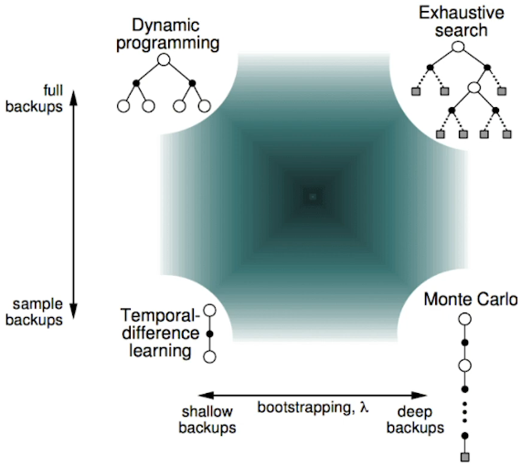

# Model-Based
- Dynamic Programming: Danamic sequential + Optimized programming
  - Prperty: Decompsed into subproblems, Subproblems recur many times
  - Markov Devision Processes satisfy both properties
  - Assume full knowledge of the MDF
  - i.e. Model is known
    - Transition probablilty, Reward are known
    - Full Width Back-up
## Prediction: Policy Evaluation
  - Policy $\pi$ is given → Evaluate policy
    - $$v_{k+1} = \sum_{a\in A} \pi(a|s)\left (R_s^a+\gamma\sum_{s'\in S}P_{ss'}^av_k(s')\right)$$: Bellam Expectaton Equation
## Control: Policy Iteration
  - Policy $\pi$ is given → Evaluate policy → Improve policy 
    - $$\pi'=greedy(v_\pi)$$: Greedy Policy Improvement
  - Iteration
    - (→ Evaluate policy → Improve policy → Evaluate policy → Improve policy → Evaluate policy → Improve policy)
  - If improvements stop
    - $$q_{\pi} (s,\pi'(s))=\max_{a\in A} q_\pi(s,a)=q_\pi(s, \pi(s)) = v_\pi(s)$$
    - Bellman optimalicy eqation has been satisfred
      - $$v_\pi(s) = \max_{a\in A} q_\pi(s,a)$$
    - Therefore $v_\pi(s)=v_*(s)$ for all $s\in S$
    - **So $\pi$ is an optimal policy**
## Control: Value Iteration
  - Principle of Optimality
    - $\pi$ achieves the optimal value from state s'
    - $v_\pi(s') = v_*(s')$, $s'\in S$
  - Update iteratively
    - $$v_*(s)\larr \max_{a\in A} R_s^a+\gamma\sum_{s'\in S}P_{ss'}^av_*(s')$$: Bellman Optimality Equation
  - No explicit policy
  - But, 최종적으로 V(s)가 수렴한 뒤 greedy하게 policy를 추출
# Model-Free
## with Lookup Table
### Monte-Carlo Learning
- Learn from complete episodes: no bootstrapping
- policy $\pi$ is given
- Update V(s) incrementally after each episode
  - $$V(S_t) \larr V(S_t)+\alpha(G_t-V(S_t))$$
- Unbiased, High Variance(dependent on many random actions, transition, rewards)
- Non-Markov property
### TD Learning
- Learn from incomplete episodes, by bootstrapping
- policy $\pi$ is given
- Update a guess towoards a guess (estimated return)
  - $$V(S_t) \larr V(S_t)+\alpha(R_{t+1}+\gamma V(S_{t+1})-V(S_t))$$
  - TD target: $R_{t+1}+\gamma V(S_{t+1})$
  - TD error: $\delta_t=R_{t+1}+\gamma V(S_{t+1})-V(S_t)$
- Biased, Low Variance(dependent on one random actions, transition, rewards)
- Markov property

## with Function Approximation
- Estimate value function
  - $\hat{v}(s,w) \approx v_{\pi}(s)$
  - $\hat{q}(s,a,w) \approx q_{\pi}(s,a)$
- Goal
  - $J(w) = \mathbb{E}_\pi \left[ \left( v_\pi(S) - \hat{v}(S, \mathbf{w}) \right)^2 \right]$
- Gradient Descent
  - 전체 데이터 대상
    - $\Delta \mathbf{w} = -\frac{1}{2} \alpha \nabla_{\mathbf{w}} J(\mathbf{w}) = \alpha \, \mathbb{E}_\pi \left[ \left( v_\pi(S) - \hat{v}(S, \mathbf{w}) \right) \nabla_{\mathbf{w}} \hat{v}(S, \mathbf{w}) \right]$
  - 샘플 데이터 대상 (Stochastic)
    - $\Delta \mathbf{w} = \alpha \left[ \left( v_\pi(S) - \hat{v}(S, \mathbf{w}) \right) \nabla_{\mathbf{w}} \hat{v}(S, \mathbf{w}) \right]$
- If, $\hat{v}(S,w)=x(S)^{\top}w$ 
  - $J(\mathbf{w}) = \mathbb{E}_\pi \left[ \left( v_\pi(S) - \mathbf{x}(S)^\top \mathbf{w} \right)^2 \right]
$
  - $\Delta w=\alpha(v_{\pi}(S)-\hat{v}(S,w))x(S)$
### MC
- $\Delta w=\alpha(G_t-\hat{v}(S,w))\nabla_w\hat{v}(S_t,w)$
### TD
- TD(0): $\Delta w=\alpha(R_{t+1}-\lambda\hat{v}(S_{t+1},w))\nabla_w\hat{v}(S_t,w)$
# Actor Critic
