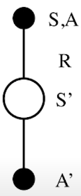
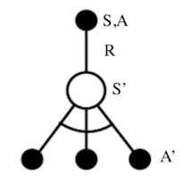

# Model-Based
- Dynamic Programming: Danamic sequential + Optimized programming
  - Prperty: Decompsed into subproblems, Subproblems recur many times
  - Markov Devision Processes satisfy both properties
  - Assume full knowledge of the MDF
  - i.e. Model is known
    - Transition probablilty, Reward are known
    - Full Width Back-up
## Prediction: Policy Evaluation
  - Policy $\pi$ is given → Evaluate policy
    - $$v_{k+1} = \sum_{a\in A} \pi(a|s)\left (R_s^a+\gamma\sum_{s'\in S}P_{ss'}^av_k(s')\right)$$: Bellam Expectaton Equation
## Control: Policy Iteration
  - Policy $\pi$ is given → Evaluate policy → Improve policy 
    - $$\pi'=greedy(v_\pi)$$: Greedy Policy Improvement
  - Iteration
    - (→ Evaluate policy → Improve policy → Evaluate policy → Improve policy → Evaluate policy → Improve policy)
  - If improvements stop
    - $$q_{\pi} (s,\pi'(s))=\max_{a\in A} q_\pi(s,a)=q_\pi(s, \pi(s)) = v_\pi(s)$$
    - Bellman optimalicy eqation has been satisfred
      - $$v_\pi(s) = \max_{a\in A} q_\pi(s,a)$$
    - Therefore $v_\pi(s)=v_*(s)$ for all $s\in S$
    - **So $\pi$ is an optimal policy**
## Control: Value Iteration
  - Principle of Optimality
    - $\pi$ achieves the optimal value from state s'
    - $v_\pi(s') = v_*(s')$, $s'\in S$
  - Update iteratively
    - $$v_*(s)\larr \max_{a\in A} R_s^a+\gamma\sum_{s'\in S}P_{ss'}^av_*(s')$$: Bellman Optimality Equation
  - No explicit policy
  - But, 최종적으로 V(s)가 수렴한 뒤 greedy하게 policy를 추출
# Model-Free (with Lookup Table)
## Prediction: Policy Evaluation
### Monte-Carlo Learning
- Learn from complete episodes: no bootstrapping
- policy $\pi$ is given
- Update V(s) incrementally after each episode
  - $$V(S_t) \larr V(S_t)+\alpha(G_t-V(S_t))$$
- Unbiased, High Variance(dependent on many random actions, transition, rewards)
- Non-Markov property
### TD Learning
- Learn from incomplete episodes, by bootstrapping
- policy $\pi$ is given
- Update a guess towoards a guess (estimated return)
  - $$V(S_t) \larr V(S_t)+\alpha(R_{t+1}+\gamma V(S_{t+1})-V(S_t))$$
  - TD target: $R_{t+1}+\gamma V(S_{t+1})$
  - TD error: $\delta_t=R_{t+1}+\gamma V(S_{t+1})-V(S_t)$
- Biased, Low Variance(dependent on one random actions, transition, rewards)
- Markov property
- Forward View TD(λ)
- Backward View TD($\lambda $)
  - $$V(S_t) \larr V(S_t)+\alpha \delta_t E_t(s)$$
  - $E_t(s)$: Eligibility Trace
    - Frequency heuristic + Recency heuristic
    - 과거에 얼마나 자주, 얼마나 최근에 방문했는지에 따른 credit
  - TD(1) = MC
    - credit is deffered until end of episode

## Control: Policy Iteration
- Greedy policy improvement over V(s) requires model of MDP
- Greedy policy improvement over Q(s,a) is model-free
  - $$\pi'(s)=\argmax_{a\in A} Q(s,a)$$
- $\epsilon$-Greedy Exploration
  - $$\pi(a|s)=\begin{cases}\frac{\epsilon}{m} + 1 - \epsilon & \text{if } a^* = \arg\max\limits_{a \in \mathcal{A}} Q(s, a) \\ \frac{\epsilon}{m} & \text{otherwise} \end{cases}$$
  - All m actions are tried with non-zero probability
- Greedy in the Limit with Infinite Exploration (GLIE) should be satisfied
  - All state-action pairs are explored inifinitely many times
    - $$\lim_{k\rarr \infin} N_k(s,a) = \infin$$
  - The policy converges on a greedy policy
    - $$\lim_{k\rarr \infin} \pi_k(a|s)=1(a=\argmax_{a'\in A} Q_k(s,a'))$$
    - 결국 Optimal Policy 가 탄생한다.
  - $\epsilon$-greedy에서 $\epsilon_k = {1\over k}$ 일 때, $\epsilon$가 0에 수렴하여 가장 greedy한 policy 가 탄생한다.
### On-Policy Learning
#### GLIE MC Control
  - Sample $k$th episode using $\pi$
    - $N(S_t, A_t) \larr N(S_t, A_t)+1$
    - $Q(S_t. A_t) \larr Q(S_t, A_t)+ {1 \over N(S_t, A_t)}(G_t-Q(S_t,A_t))$
  - Improve policy
    - $\epsilon \larr {1\over k}$
    - $\pi \larr$ $\epsilon$-greedy(Q)
  - Converge to the optimal action-value function
    - $Q(s,a) \rarr q_*(s,a)$
#### TD Control: Sarsa
  - 
  - $Q(S,A) \larr Q(S,A)+\alpha(R+\gamma Q(S',A')-Q(S,A))$
#### n-step Sarsa
  - n-step Q-return
    - $$q_t^{(n)}=R_{t+1} + \gamma R_{t+2} +...+\gamma ^{n-1}R_{t+n}+\gamma ^n Q(S_{t+n})$$
  - Update Q(s,a)
    - $$Q(S_t,A_t) \larr Q(S_t,A_t)+\alpha(q_t^{(n)}-Q(S_t,A_t))$$
#### Forward View Sarsa(λ), Backward View Sarsa(λ)
### Off-Policy Learning
- Evaluate target policy $\pi(a|s)$ to compute $v_\pi (s)$ or $q_\pi (s,a) $
- While following behaviour policy $\mu (a|s)$
- Estimate the expectation of a different distribution
  - $$E_{X \sim P}[f(X)]=\sum P(X)f(X) = \sum Q(X){P(X)\over Q(X)}f(X)=E_{X\sim Q}\left[{P(X)\over Q(X)}f(X)\right]$$
  - P(X)에서 직접 샘플링하기 어려울 때, 샘플링이 쉬운 Q(X)에서 데이터를 뽑고, P/Q로 확률비를 보정하여 P에서 결과를 추정
#### MC Control
- Use returns generated from μ to evaluate π
- Weight return $G_t$ according to similarity between policies
- Multiply importance sampling corrections along whole episode
  - $$G_t^{\pi/\mu}={\pi(A_t|S_t) \over \mu(A_t|S_t)}{\pi(A_{t+1}|S_{t+1}) \over \mu(A_{t+1}|S_{t+1})}{...}{\pi(A_T|S_T) \over \mu(A_T|S_T)}G_t$$
- Update value towards corrected return
  - $$V(S_t) \larr V(S_t)+\alpha(G_t^{\pi/\mu}-V(S_t))$$
#### TD Control: Q-Learning
- No importance sampling is required
- Next action is chosed using behaviour policy $A_{t+1} \sim \mu(\cdot|S_t)$
  - 환경과 상호작용에 필요, 하지만 업데이트에는 쓰이지 않음
- But we consider alternative successor action $A'\sim \pi(\cdot|S_t)$
  - 학습(업데이트)에 사용되는 대체 행동, target policy 기준
- Update Q(S_t,A_t) towards value of alternative action
  - $$Q(S_t,A_t) \larr Q(S_t,A_t)+\alpha(R_{t+1}+\gamma Q(S_{t+1},A')-Q(S_t,A_t))$$
- Improve taget policy π (which is greedy)
  - $\pi(S_{t+1})=\argmax_{a'}Q(S_{t+1},a')$
  - While, behaviour policy μ is e.g. ε-greedy
  - Then, Q-learning target is simplified
    - $$R_{t+1} + \gamma Q(S_{t+1}, A')=R_{t+1} + \gamma Q(S_{t+1}, \argmax _{a'}Q(S_{t+1},a'))=R_{t+1} + \max_{a'}\gamma Q(S_{t+1}, A')$$
  - 

# Model-Free with Function Approximation
## Function Approximation
- Estimate value function
  - $\hat{v}(s,w) \approx v_{\pi}(s)$
  - $\hat{q}(s,a,w) \approx q_{\pi}(s,a)$
- Goal
  - $J(w) = \mathbb{E}_\pi \left[ \left( v_\pi(S) - \hat{v}(S, \mathbf{w}) \right)^2 \right]$
- Gradient Descent
  - 전체 데이터 대상
    - $\Delta \mathbf{w} = -\frac{1}{2} \alpha \nabla_{\mathbf{w}} J(\mathbf{w}) = \alpha \, \mathbb{E}_\pi \left[ \left( v_\pi(S) - \hat{v}(S, \mathbf{w}) \right) \nabla_{\mathbf{w}} \hat{v}(S, \mathbf{w}) \right]$
  - 샘플 데이터 대상 (Stochastic)
    - $\Delta \mathbf{w} = \alpha \left[ \left( v_\pi(S) - \hat{v}(S, \mathbf{w}) \right) \nabla_{\mathbf{w}} \hat{v}(S, \mathbf{w}) \right]$
- If, $\hat{v}(S,w)=x(S)^{\top}w$ 
  - $J(\mathbf{w}) = \mathbb{E}_\pi \left[ \left( v_\pi(S) - \mathbf{x}(S)^\top \mathbf{w} \right)^2 \right]
$
  - $\Delta w=\alpha(v_{\pi}(S)-\hat{v}(S,w))x(S)$
### MC
- $\Delta w=\alpha(G_t-\hat{v}(S,w))\nabla_w\hat{v}(S_t,w)$
### TD
- TD(0): $\Delta w=\alpha(R_{t+1}-\lambda\hat{v}(S_{t+1},w))\nabla_w\hat{v}(S_t,w)$