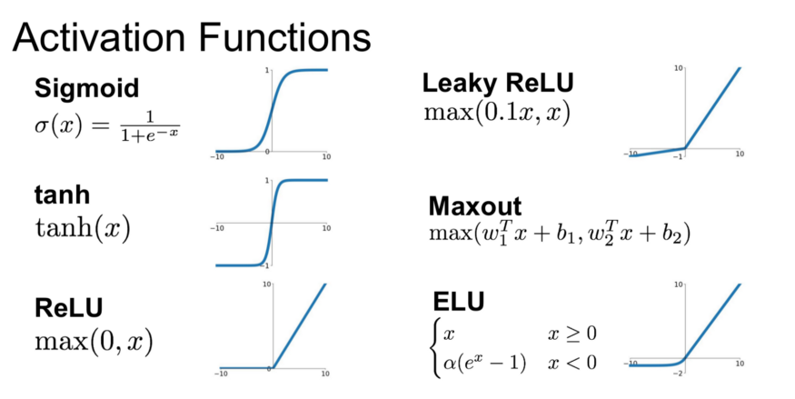

## FCNN 신경망 이란?
- 완전 연결 신경망, Fully-Connected Neural Network
- 인공신경망의 기본적인 형태로, 각 층의 모든 노드가 다음 층의 모든 노드와 연결된 구조
- 입력층, 하나 이상의 은닉층, 출력층으로 구성되며, 각 연결마다 가중치가 존재

## 손실함수 란?
- 모델이 예측한 값과 실제 정답 사이의 차이를 수치화 하는 함수
- 회귀 문제에서는 평균제곱오차(Mean Squared Error),
- 분류 문제에서는 교차 엔트로피 손실(Cross-Entropy Loss)을 주로 사용
- 이 값을 최소화하는 방향으로 가중치를 업데이트

## 경사하강법 이란?
- 신경망이 손실 함수를 최소화하기 위해 사용하는 대표적인 최적화 알고리즘
- 손실 함수의 기울기, 즉 **그레이디언트(gradient)**를 계산하여, 손실함수를 최소화하는 방향으로 가중치를 조금씩 조정한다.
- 이 때, 학습률(learning rate)은 한 번에 얼만큼 가중치를 조정할 것인지를 결정한다.

## 활성화 함수란?
- 비선형 함수로 인공신경망에서 각 뉴런의 출력값을 받아 다음 뉴런에 전달하는 역할을 하는데, 비선형성을 통해 신경망의 표현력을 높인다.
    - 비선형성이 없으면 결국 하나의 선형 함수와 동일한 효과
- 대표적으로 ReLU(Rectified Linear Unit), Sigmoid, 하이퍼볼릭Tanh 등이 있다.

    

## 정규화 기법이란? 
- Dropout, L2 Regularization 등은 과적합을 방지하고 모델을 일반화하는데 사용

## 초기 가중치 설정
- He 초기화, Xavier 초기화와 같은 방법은 학습 초기에 적절한 분산을 제공하여 안정적인 학습을 돕는다.

## 하이퍼파라미터 란?
- 모델이 학습하기 전에 사용자가 직접 설정해야 하는 값들로
  - 학습률(learning rate), 에폭 수(epoch), 배치 크기(batch size), 은닉층의 개수와 뉴런 수, 활성화 함수, 정규화 계수 등
- 과적합 방지와 모델 성능 향상에 중요하기 때문에 최적의 조합을 찾아 초기화 해야 함

## CNN 이란?
- 합성곱 신경망, Convolutional Neural Network
- 필터(커널)를 통해 국소적인 영역에서 특징을 추출하여 패턴을 학습
- 합성곱 연산 → 활성화 함수 → 풀링(특징맵의 크기를 줄이고, 정보를 일반화 하는 과정)
- 이미지, 영상, 음성 데이터처럼 공간적 구조가 있는 데이터 분석에 유리
  
## RNN 이란?
- 순환 신경망, Recurrent Neural Network
- 시계열 데이터나 순차적 데이터를 처리하기 위한 신경망 구조로, 이전 시점의 출력을 현재 시점의 입력으로 다시 활용함으로써 시간의 흐름에 따른 정보를 학습할 수 있는 모델
- hidden state(은닉 상태)가가 이전까지 입력된 정보를 요약해 담고 있는 일종의 "메모리" 역할
- 시간이 지남에 따라 과거 정보가 희미해지는 기울기 소실 문제 발생 가능
    - 역전파 시, 손실 함수의 기울기를 시점을 따라 계속 곱하면서 계산하는데 0보다 크고 1보다 작은 수를 계속 곱하면 0이 됨
## LSTM 이란?
- 장단기 메모리, Long short-term memory
- 장기 의존성(Long-term dependency) 문제를 해결하기 위해 고안된 RNN의 확장 버전전
- 셀 상태(Cell State)와 세 가지 게이트(입력, 망각, 출력 게이트)로 구성되어 있으며,
  - 셀 상태는 망각 게이트(Forget Gate)와 입력 게이트(Input Gate)의 조합으로 결정되며 과거 정보 중 중요한 것만 남기고 최신 정보를 반영한 상태를 유지
  - RNN과 달리 셀 상태에서는 곱셈만 하지 않고, 덧셈을 통해 정보를 업데이트하기 때문에 기울기 소실(gradient vanishing) 문제를 해결

## Word2Vec 이란?
- 단어를 고정된 크기의 실수 벡터로 변환하는 임베딩(embedding) 기법
- 단어의 의미가 유사할수록 가까운 벡터로 표현함으로써, 의미적 유사성을 수치적으로 표현
- 단어 간의 의미적 연산 가능: $king−man+woman≈queen$

## Seq2Seq 란?
- Encoder-Context Vector-Decoder로 구성되어, 어순과 길이가 다른른 다양한 언어를 번역하는데 유용한 모델
    - Encoder: 입력 시퀀스를 한 단어씩 읽어 전체 의미를 요약
    - Context Vector: 인코더가 만든 요약된 의미의 담고 있음
    - Decoder: 출력 시퀀스를 한 단어씩 생성
- 인코더와 디코더가 서로 다른 가중치를 사용하기 때문에 입력개수와 출력개수가 같을 필요가 없다.
- Context Vector에 모든 정보가 압축되기 때문에 입력 문장이 길수록 중요한 정보가 손실되는 한계가 있다.  

## Attention 이란?
- 인코더와 디코더로 구성되어 있으며, 디코더가 출력 단어를 생성할 때 입력 문장 전체를 참고한다.
- 이 때, 출력 시점에서 예측해야 할 단어와 연관이 큰 입력 단어에 더 집중(attention)하는 기법
  - Seq2Seq의 Context Vector에 모든 정보가 요약되어 발생하는 문제를 해결
- 수식: $Attention(Q, K, V) = Attention Value$

    | 이름            | 역할               | 비유 (도서관 예시)   | 구성             |
    | ------------- | ---------------- | ------------- | -------------- |
    | **Query (Q)** | **찾고 싶은 질문**     | “요리책 어디 있어요?” | 디코더의 현재 상태     |
    | **Key (K)**   | **모든 입력의 주소/태그** | 각 책의 제목/분류표   | 인코더의 각 단어에서 추출 |
    | **Value (V)** | **실제 내용**        | 책 안의 본문 내용    | 인코더의 각 단어에서 추출 |
- 작동 순서
    1. Query와 Key 간 유사도 계산 (어떤 입력이 중요한지 판단)
        - 내적하여 Score 생성: $Score_i=Q*K_i$
    2. Score를 Softmax로 정규화 (확률처럼 만듦)
        - $\alpha_i=Softmax(Score_i)$
    3. Value 벡터에 가중치 곱해서 최종 출력을 생성
        - $Attention Output=\sum{a_i*V_i}$
          - 이것이 일종의 Context Vector, 하지만 Seq2Seq와 달리 디코딩 시점마다 동적으로 생성되며 필요한 정보만 집중해서 가지고 있음
- Self-Attention 이란?
  - 하나의 문장 내에서 각 단어가 다른 단어들과의 연관성을 계산하여, 의미적으로 중요한 단어에 더 집중하는 메커니즘
  - 순차적인 계산 없이 병렬로 처리되며, 문맥 이해 능력을 극대화하기 위해 각 단어가 문장 전체를 참고
  - Attention은 “입력과 출력이 다른 두 시퀀스 사이”의 연관성을 계산하지만, Self-Attention은 “하나의 시퀀스 내”에서 각 요소끼리의 연관성도 계산

## Transformer 란?
- 순차적인 계산 없이 입력 전체를 동시에 처리할 수 있는 인코더-디코더 구조를 갖는 대표적인 자연어 처리 모델
- Self-Attention 통해 문맥을 효과적으로 이해하고 표현
- 인코더와 디코더 두 부분으로 구성
  - 인코더: 입력 문장에 Self-Attention을 적용하여 문맥 정보가 담긴 벡터로 재구성
  - 디코더: 지금까지 생성된 단어들을 참고하여 다음 단어를 예측
- 기존 RNN은 “나는 → 오늘 → 아침에...” 순서대로 처리, Transformer는 모든 단어를 한 번에 보고, “마셨다”가 “커피”와 가장 관련 있다고 Self-Attention을 통해 학습
  
## 지도학습과 비지도학습의 차이
- 지도학습은 입력 데이터와 함께 정답(label)이 주어져 모델이 이를 학습하는 방식이고, 비지도학습은 정답 없이 데이터 자체의 구조나 패턴을 학습하는 방식
  
    | 항목          | **지도학습 (Supervised)**              | **비지도학습 (Unsupervised)**                         |
    | ----------- | ---------------------------------- | ------------------------------------------------ |
    | **입력 데이터**  | 입력 + 정답(label) 존재                  | 정답(label) 없음                                     |
    | **목표**      | 정답을 맞히도록 학습                        | 데이터의 구조/패턴 발견                                    |
    | **대표 과제**   | 분류(Classification), 회귀(Regression) | 군집화(Clustering), 차원 축소(Dimensionality Reduction) |
    | **예시**      | 이메일 → 스팸 or 정상                     | 고객 구매 패턴 군집화                                     |
    | **필요한 데이터** | 라벨링된 데이터 필요                        | 비라벨링된 데이터로 가능                                    |

## 과적합이란 무엇이며 어떻게 방지할 수 있나요?
과적합은 모델이 학습 데이터에 너무 맞춰져서 새로운 데이터에 대해 일반화가 잘 안 되는 현상입니다. 즉, 훈련 정확도는 높지만 테스트 성능은 낮습니다.이를 방지하기 위해 정규화(L1, L2), Dropout, 데이터 증강, 조기 종료(Early Stopping), 교차 검증(K-fold) 등을 사용합니다.
또한 모델의 복잡도를 줄이거나 더 많은 학습 데이터를 확보하는 것도 효과적인 방법입니다.

## "모델이 학습한다"는 말의 의미는?
모델이 학습한다는 것은 주어진 데이터를 기반으로 가중치와 편향 같은 매개변수를 조정하여, 손실 함수를 최소화하는 방향으로 최적화해 나가는 과정을 의미합니다. 즉, 입력 데이터와 정답 간의 관계를 수학적으로 추정하는 함수를 찾아내는 과정입니다. 이를 통해 모델은 새로운 데이터에 대해서도 적절한 예측을 할 수 있게 됩니다.

## 강화학습이란?
강화학습은 에이전트가 환경과 상호작용하면서 보상을 최대화하는 방향으로 학습하는 방법입니다. 정답(label)이 주어지지 않고, 시행착오(trial-and-error)를 통해 경험을 쌓으며 학습합니다. 
- 예시
    - 알파고: 바둑에서 승리 보상을 최대화하기 위해 강화학습 사용
    - 로봇 제어: 로봇 팔이 물건을 정확히 잡는 법을 반복 학습
  
## Gaussian Processes(가우시안 프로세스, GP) 란?
함수 f(x) 를 명시적으로 정의하지 않고도, 주어진 입력값들에 대해 출력이 어떤 확률 분포를 가질지를 추정
   - 예를 들어, 3개의 데이터 포인트가 주어졌을 때, GP는 이를 통과할 가능성이 높은 모든 함수의 분포를 고려
   - 파라미터 수가 고정되어 있지 않고 데이터에 따라 늘어나며
   - 예측값만 제공하지 않고 예측값의 신뢰도(신뢰 구간)도 같이 제공
