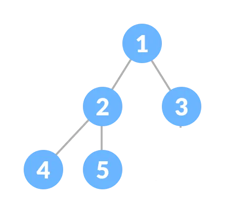

## 1. Heap
- Priority Queue를 빠르게 구현하게 위해 만든 트리기반 자료 구조
- Complete Binary Tree 형태를 취함
- 

### 1-1. Priority Queue(우선순위 큐)란?
- 일반적인 큐: FIFO 선입선출
- Priority Queue: 데이터에 우선순위 부여 → 우선순위 높은 것이 먼저 나감
  - 삽입순서 무관
  - 우선순위는 주로 정수로 표현
  - 예시1: 응급실에서는 심각한 환자부터 치료
  - 예시2: 운영체제 스케쥴러는 우선순위 높은 자료부터 처리

### 1-2. Complete Binary Tree 란?
- 왼쪽부터 빈틈없이 채워진 이진 트리 = 모든 상위 레벨은 꽉 참 + 마지막 층만 왼쪽부터 참
- 노드 개수는 n개
- 루트에서 리프까지의 최장 경로 = 트리의 높이(h)
- 이진 트리는 각 레벨마다 노드 수가 2배씩 증가(따라서 n개의 노드를 모두 담기 위해 필요한 깊이는 log₂n 레벨이면 충분)
- 총 노드 수의 합은 등비수열
  - $n=1+2+4+⋯+2^h = 2^{h+1}−1$
- 높이를 구하는 공식
  - $log_2 (n+1) = log_2 2^{h+1}=h+1$

----------
{: width="50%" height="50%"}

## 2. 왜 Complete Binary Tree 를 사용하는가?
- 삽입 또는 삭제할 때 트리모양을 정해진 규칙으로 유지해야 시간 복잡도 $O(log n)$를를 보장
- 시간 복잡도 $O(log n)$를 보장한다는 뜻은?
  - 항상 최악의 경우에도 $O(log n)$ 시간 안에 작업을 종료함

### 2-1. 왜 Complete Binary Tree에서는 $O(log n)이$ 보장되는가?
- 힙은 완전 이진 트리이므로 트리의 높이(height)는 log₂ n
- 트리의 노드 수가 n개일 때, 높이는 최악의 경우에도 log₂ n에 가까우므로 연산이 루트부터 리프까지 진행돼도 log n 단계를 넘지 않음
----------
| 연산         | 동작 설명                                                          | 시간복잡도    |
| ---------- | -------------------------------------------------------------- | -------- |
| `insert()` | 새로운 값을 말단에 추가 후, 부모와 비교하며 위로 올라감(up-heap / bubble-up)          | O(log n) |
| `pop()`    | 루트(최댓값/최솟값)를 제거 후, 말단 노드를 루트에 올리고 아래로 내려감(down-heap / heapify) | O(log n) |
| `peek()`   | 루트 노드의 값 조회 (최대/최소)                                            | O(1)     |
----------
### 2-2. "log₂ n"과 "log n"이 빅오 표기(Big-O)에서는 왜 차이가 없나?
로그 함수는 서로 상수배로 변환 가능하기 때문
$$log_2 n = {log_{10} n \over log_{10} 2} ≈ 3.32 \times log_{10} n$$
→ 밑만 다를 뿐, 형태는 동일하고 상수배만 차이남

→ 빅오 표기에서는 상수를 무시하므로 다음은 모두 동일한 시간복잡도로 간주

→ 복잡도 분석에서는 어떤 로그든 O(log n)으로 통일해서 사용
$$O(log_2 n)=O(log_{10} n)=O(lnn)=O(log n)$$
  
## 3. Time Complexity(시간복잡도) 
- 시간복잡도 "O" 란 : 입력 크기 n이 커질 때 알고리즘이 걸리는 시간(연산 수)이 어떻게 증가하는가?
- "$O$": 빅오(더)
- $O(n)$: n 차수로 증가
- $O(n^2)$: $n^2$ 차수로 증가
- $O(log n)$: $log n$ 차수로 증가
- $O(2^n)$: $2^n$ 차수로 증가

### 예시
시간복잡도는 해당 함수에서 가장 영향이 큰 항만 남김
$$O(3n^3+5n+100) = O(n^3)$$
