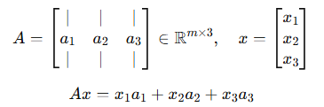

# 1장 기초 수학과 미적분

## 오일러의 수
- 오일러의 수 e는 미분값이 자기 자신인 수
- 기울기 계산 시 효율적이며, 인공신경망에서 시그모이드 함수나 소프트맥스 함수에 사용 됨
- 오일러의 수 e를 밑으로 사용하는 로그 $ln()$를 자연로그 라고 합니다.
- $(1+{1 \over n})^n$ 에서 n이 무한대로 커지면 약 2.781828에 수렴

## 미분(Derivative)
- x의 아주 작은 변화량에 대한 y의 변화량, 즉 기울기를 구하는 것입니다.
- 합성함수를 미분할 때 연쇄법칙을 적용할 수 있으며,
- 연쇄법칙을 이용해 신경망에서 오차역전파를 수행할 때 각 노드의 도함수를 곱하여 손실함수에 대한 미분값을 구할 수 있다.
 $${dz \over dx} = {dz \over dy}\times{dy \over dx}$$
- 편도함수란?
  - $f(x,y) = 2x^3 + 3y^3$ 일 때, x와 y변수는 각각 고유한 도함수(기울기=gradient) $df \over dx$와 $df \over dy$를 갖음

## 적분

# 2장 확률
## 확률 이해
- 확률(probability)은 아직 일어나지 않은 사건에 대한 예측이고 가능도(likelihood)는 이미 발생한 사건의 빈도입니다. 머신러닝에서는 확률(미래)을 예측하기 위해 데이터 형태의 가능도(과거)를 사용합니다.
  - 확률: Sum(모든 상호 배타적인 결과의 확률) = 1
  - 가능도: Sum(모든 상호 배타적인 결과의 가능도) 이 1 아닐 수 있음

## 오즈(Odds)
- 어떤 사건이 일어날 확률을 일어나지 않은 확률과 비교하여 표현합니다. 오즈가 2.0 이면? 일어날 확률이 그렇지 않을 확률보다 두배 더 큽니다.

$$P(X)={O(X) \over {1+O(X)}}\,\,\,\,\,\,\,\,\,\,\, O(X)={P(X) \over {1-P(X)}}$$

## 확률의 Indepenency
- 사건 A가 발생할 때, 사건 B가 일어날 확률에 영향을 받지 않으면, 두 사건은 서로 독립적입니다.
- 이 때, A와 B가 동시에 일어날 확률은 각 사건이 일어날 확률의 곱으로 표현합니다.
$$P(A \,and\, B)=P(A)\times P(B)$$
- 반대로 사건 A가 일어날 확률이 사건 B가 일어날 확률로부터 영향을 받을 때 두 사건은 독립적이지 않으며, 이 때 A와 B가 동시에 일어날 확률은 B가 일어났다는 가정하에 A가 일어날 확률에 B가 일어날 확률의 곱으로 표현합니다.
$$P(A \,and\, B) = P(A|B)\times P(B)$$
- 이를 확률의 결합법칙이라고 합니다.

## 확률의 덧셈법칙
- 두 사건 중 하나라도 일어날 확률은 각각의 확률을 더한 뒤 동시에 일어날 확률을 빼줘야 합니다.
  - $P(A \,or\, B) = P(A) + P(B) - P(A|B)\times P(B)$
  
## 조건부 확률(Conditional Probability)
- B가 발생했다는 조건 하에서 A가 발생할 확률을 의미합니다.
  - $P(A Given B)$ 또는 $P(A|B)$
  - P(암|커피)

## 베이즈 정리(Bayesian Rule)
- 사후 확률(조건부 확률)을 라이클리후드와 사전 확률의 곱으로 표현(Decomposition)한 것입니다. 
- "과거의 믿음(Prior)"을 "새로운 증거(Likelihood)"로 갱신하여 "최종 판단(Posterior)"을 내리는데 유용
  - $$P(A|B)={P(B|A)\times P(A)\over P(B)} = {P(A \,AND\, B) \over P(B)}$$
  - $$사후확률(Posteior) = {{우도(Likelihood)\times 사전확률(Prior)} \over 증거}$$
  - 우도: 관측된 데이터

## 이항 분포
## 베타 분포

# 3장 기술 통계와 추론 통계

- 기술 통계
  - 데이터를 요약
  - 평균 mean, 중앙값 median, 모드 mode, 차트, 종 곡선을 계산
    - 중앙값: 정렬된 값 집합 중 가장 가운데 값, 이상치로 평균을 신뢰할 수 없을 때 유용한 대안
    - 모드: 가장 자주 발생하는 값
- 추론 통계
  - 표본을 기반으로 모집단에 대한 속성을 발견
  - 일종의 유추

## 3-1 기술 통계
### 모집단
- 연구하고자 하는 특정 관심 그룹
- 분산
  - 편차의 제곱의 평균
  - $$\sigma^2 = {{\sum(x_i-\mu)^2}\over N}$$
- 표준편차
  - 분산에서 제곱을 제거
  - $$\sigma=\sqrt {{\sum(x_i-\mu)^2}\over N}$$
### 표본
- 모집단의 하위 집합 
- 무작위, 편향되지 않음
- 모집단에 대한 속성을 추론하기 위한 목적
- 분산
  - $$s^2 = {{\sum(x_i-\bar{x})^2}\over n-1}$$
- 표준편차
  - $$s=\sqrt {{\sum(x_i-\bar{x})^2}\over n-1}$$
- n이 아닌 n-1로 나누는 이유는?
  - 표본의 분산을 증가시켜 표본의 불확실성을 더 많이 표현하는 것으로
  - 표본에 기반한 모집단의 분산을 과소평가하지 않기 위함
  
### 정규 분포(Normal Distribution), 가우스 분포(Gaussian distribution)
- $N(m, \sigma^2)$
- 평균 근처가 가장 질량이 크고, 대칭 형태를 띤 종 모향 분포입니다. 
- 자연과 일상생활에서 일어나는 많은 현상이 이 분포를 따르고 있으며, 중심 극한 정리 덕분에 정규 분포가 아닌 문제도 표본의 크기가 충분히 크면 정규 분포를 따른다고 볼 수 있습니다.
- 인공신경망의 초기 가중치 값이 정규 분포를 따른다고 가정하며 이는 각 가중치를 무작위로 설정하여 학습을 가능하게 하는데 유용합니다.
  
### 표준 정규 분포(Standard Normal Distribution)
- 평균이 0이고 표준 편차가 1이 되도록 정규 분포의 크기를 정규화한 분포입니다. 정규화를 통해 평균과 분산이 다른 정규 분포들을 쉽게 비교할 수 있습니다. 
- 모든 x 값을 표준 편차, 즉 z 점수로 표현
  - $$z={{x-\mu \over \sigma}}$$

## 3-2. 추론 통계
### 중심 극한 정리(Central Limit Theorem, CLT)
- 모집단에서 충분히 많은 표본을 추출하면 해당 모집단이 정규 분포를 따르지 않더라도 표본의 평균이 정규 분포를 따른다.
- 단, 표본은 독립적이고 같은 분포에서 무작위로 추출되어야 합니다.(IID: Independently Identically Distributed) 된 Random Sample
- 이 정규분포는 평균은 모집단의 평균과 같아지고, 분산은 모집단의 분산을 표본의 크기로 나눈 값과 같습니다. 
- 특히, 모집단이 어떤 분포를 따르더라도 표본 평균의 분포는 무조건 정규 분포를 따르게 할 수 있다는 것이 가장 핵심이라고 생각합니다.

### 신뢰구간
- 표본으로 모집단을 추정할 때, 얼마의 신뢰도를 갖을 것인지를 측정
- 예를 들어 표본의 평균이 모집단의 평균의 특정 구간에 속한다고 얼마나 확신하는지?
- 예시
  - 표본 평균이 64.408이고 표준 편차가 2.05인 골든 리트리버 31마리의 표본을 기준으로 모집단 평균이 63.686에서 65.1296 사이에 있다고 95% 확신한다.
- $\plusmn1.95996$ 은 표준 정규 분포의 중심에서 확률의 95%에 해당하는 임계 z값
### p 값이란?
### 가설 검정
### t 분포: 소규모 표본 처리

# 4장 선형대수학

## 벡터란?
- 벡터는 데이터를 시각적으로 표현한 것으로 방향과 길이를 가지고 있습니다. 
- 벡터간의 덧셈과, 스칼라(Scalar)곱을 이용해 벡터를 늘이거나 줄일 수 있습니다. 
  - 덧셈의 결합법직: $\overrightarrow{v}$이동 후 $\,\overrightarrow{w}$ 이동 하든지, 그 반대로 하든지 상관 없음

## Vector Space란?
- 8개의 공리를 만족하며, 덧셈과 스칼라곱 연산에 의해 항상 같은 공간 안에 머무는 벡터의 집합입니다.
- 8개의 공리는 덧셈과 스칼라곱에 대한 법칙으로 교환 법칙, 결합 법칙, 분배법칙, 항등원 존재 등이 있습니다. 
- 대표적으로 linear subspace가 있으며, 벡터들의 linear combination으로 표현되는 space 입니다.
  - 덧셈 관련
    (1) 교환 법칙: u+v=v+u
    (2) 결합 법칙: (u+v)+w=u+(v+w)
    (3) 항등원 존재: 0 벡터가 존재하여 𝑣+0=𝑣
    (4) 역원 존재: v+(−v)=0
  - 스칼라곱 관련
    (5) 분배법칙 1: a(v+w)=av+aw
    (6) 분배법칙 2: (a+b)v=av+bv
    (7) 결합법칙: a(bv)=(ab)v
    (8) 항등원: 1⋅𝑣=𝑣

## 내적(Dot Product)이란
- 두 벡터가 얼마나 닮았는지를 표현하는 개념으로, 하나의 스칼라 값을 반환합니다.
  - $\begin{bmatrix} 1 \\ 3 \end{bmatrix} \cdot \begin{bmatrix} 4 \\ 2 \end{bmatrix}$ = 1 x 4 + 3 x 2 = 10
- 대수적으로는 각 성분을 곱하고 그 결과를 모두 더한 값이며, 
- 기하학적으로는 하나의 벡터를 다른 벡터에 projection 하여 각 길이를 서로 곱한 것으로 방향이 유사할 수록 내적의 크기가 증가하며, 두 벡터가 서로 수직이면 내적이 0이 되고 서로 관계가 없음을 의미합니다. 
  - a⋅b=∥a∥∥b∥cos(θ)
    - ∥a∥, ∥b∥: 벡터의 크기(길이)
- 인공지능에서는 데이터 간의 유사성을 구할 때 많이 이용됩니다. 예를 들어, Word2Vec에서 임베딩 모델에서 단어를 벡터로 표현한 뒤, 두 단어 벡터의 내적을 통해 의미의 유사성을 판별합니다.

## 스팬과 선형 종속
- 다른 두 개의 벡터에 덧셈과 스칼라곱을 적용하여 펼쳐지는 공간입니다.
  - 두개의 벡터가 서로 다른 방향을 향하고 있어, 선형 독립(Linearly Independent)이면 모든 영역을 스팬하고, 
  - 같은 방향이나 동일 선상에 존재하면 선형 종속(Linearly Dependent)이기 때문에 제한된 영역만 스팬할 수 있습니다.
  - (하나의 벡터를 스케일링하여 다른 벡터를 만들 수 있을 때 선형 종속)

## 선형 변환(Linear Transformation)
- 선형성을 유지하면서 벡터 공간의 점들을 이동하는 것입니다.
- 선형성이란 벡터의 덧셈과 스칼라곱 모두를 만족한다는 것이다. 
- 선형 변환은 크게 스케일, 회전, 반전(Transpose), 전단 등이 있다. 
  - 스케일: 늘어나거나 줄어듬
  - 회전: 공간을 돌림
  - 반전: 공간을 뒤집어 $\hat{i}$과 $\hat{j}$의 위치를 바꿈(Transpose)
  - 전단: 특정 방향의 직선과의 거리에 비례하여 각 포인트를 이동

## 기저 벡터(Basis Vector)
- 어떤 벡터 공간을 완전히 표현할 수 있게 해주는 기초적인 벡터로, 길이가 1이고 서로 수직이거나 독립적인 방향을 갖는다.
  - 모든 벡터를 만들거나 변화하기 위한 구성 요소
  - $$\hat{i}=\begin{bmatrix} 1 \\ 0 \end{bmatrix}, \,\hat{j}=\begin{bmatrix} 0 \\ 1 \end{bmatrix}, \,기저벡터 = \begin{bmatrix} 1 & 0 \\ 0 & 1 \end{bmatrix}$$

## 행렬 벡터의 곱셈
- 행렬 벡터의 곱셈은 벡터를 선형 변환하여 새로운 벡터를 만드는 것으로 Ax = b 에서 행렬 A가 변환을, 벡터 x는 입력을 의미하며, Ax는 변화 후의 새로운 벡터를 나타낸다. 
- 행렬 A의 각 행벡터가 입력 벡터 x와 내적하여 새로운 원소를 만드는 것이다.
- 즉, 행렬의 곱셈은 벡터 공간에 여러 개의 변환을 적용하는 것
  - 순서: 가장 안쪽부터 바깥쪽으로 변환을 적용
  - 행렬A * 행렬B * 행렬C = (행렬A * 행렬B) * 행렬C = 행렬A * (행렬B * 행렬C)

## Matrix의 4가지 Fundamental Vector Spaces

- $A\in \R^{m\times n}$이고 $y=Ax$ 일 때
  - n: 입력 벡터의 차원 (열의 수)
  - m: 출력 벡터의 차원 (행의 수)
  - A: 입력 벡터 x를 받아 출력 벡터 y로 보내는 선형 변환
  - x: 입력공간 $\R^n$의 벡터
  - y: 출력공간 $\R^m$의 벡터
1. 열공간 (Column Space) = $C(A)$ or $range(A)$
    - 행렬 A의 행백터들이 span하는 공간으로 A와 입력 벡터 x의 선형 결합이 만들어내는 출력 공간을 의미한다. 

      
    - 예시:클래스 확률 벡터, 회귀 값, 문장 임베딩 등

2. 행공간 (Row Space) = $C(A^T)$
    - 행공간은 A의 **행벡터들(row vectors)**이 span하는 공간으로 입력 벡터 x는 행공간 내에서 작동한다.
      - 각 행벡터는 입력 벡터 x와의 내적을 통해 출력값의 한 요소를 만듦
    - A의 행들을 열처럼 생각해서 만든 $A^T$의 열공간
    - 예시: 이미지 벡터 (784차원), 텍스트 임베딩 벡터 등
3. 영공간 (Null Space) = $N(A)$
    - Ax=0(출력이 0이 되는)을 만족하는 모든 벡터 x의 집합으로 입력 공간인 행공간과 직교하는 형태를 갖는다. 
        - A의 행공간과 입력 벡터가 만날 수 없어, 출력이 없음
    - 어떤 입력 x가 영공간에 속한다는 것은 행렬 A를 통해 아무 정보도 전달하지 못한다는 것을 의미한다.
4. 좌영공간 (Left Null Space) = $N(A^T)$
    - $A^Ty=0$ 을 만족하는 모든 출력 벡터 y의 집합으로 출력공간인 열공간과 직교하는 형태를 갖는다. 
    - 행렬 A의 열공간에 출력 벡터가 존재하지 않기 때문에 선형변환으로 출력 벡터를 구할 수 없고, 입력 벡터 x의 해를 찾을 수 없다.

### 직교성(Orthogonality)
- 두 벡터 a와 b가 서로 직교한다
  - $a\cdot b=0$
- 기하학적 의미
  - 두 벡터가 이루는 각이 90도
  - Projection 했을 때, 그 길이가 0
  - 서로 전혀 닮지 않음 $\rarr$ 전혀 관련이 없음 $\rarr$ 아무 정보도 공유하지 않음

## 랭크(Rank)
- 행렬에서 컬럼 스페이스의 차원의 수로, 선형 독립적인 열벡터의 수를 의미합니다. 이는 선형 독립적인 행벡터의 수와 동일합니다. 
- 랭크는 행렬이 담고있는 정보의 차원 수를 의미하기 때문에, 랭크가 높을수록 데이터가 더 "다양한 방향성"을 가진다고 볼 수 있습니다.
  - 데이터 행렬의 랭크
    - $X\in \R^{n\times d}$
    - n: 샘플 수(행), d: 특성 수(열)
    - rank(A)=d: 모든 특성이 독립적 → 완전한 차원 정보
    - rank(A)<d: 특성 간 중복 존재 → 차원 축소 가능 (PCA 적용 가능)
    - rank(A)<<d: 특성이 과도하게 중복됨 → 고차원 과적합 가능성↑

## 행렬식(Determinant)
- 행렬식은 벡터들로 형성된 영역의 면적이나 부피를 의미합니다. 
- 또한 역행렬의 존재 여부를 나타내기도 하는데, $det(A)=0$ 이면, 선형 종속의 발생으로 차원이 축소되고 Ax=b를 만족하는 x의 유일한 해가 존재하지 않음을 의미합니다.
  - x가 없거나: 열공간에 없음
  - 무수히 많음: 예를 들어 직선 위의 모든 점

## 항등 행렬(Identity Matrix)
- 곱해서 자기자신을 결과로 출력하게 하는 행렬로, 대각선의 값이 1이고 다른 값은 0인 정사각 행렬(가로 세로 길이 동일) 입니다.
- 항등 행렬을 만들 수 있다면 선형 변환을 취소하고 원래 기저 벡터를 찾을 수 있습니다.
- $$\begin{bmatrix} 1&0&0 \\ 0&1&0 \\ 0&0&1 \end{bmatrix}$$
- 
## 역행렬(Inverse Matrix)
- 행렬의 변환을 취소하는 행렬($A^{-1}$)로 
- $A^{-1}$과 $A$를 곱셈하면 항등 행렬이 됩니다.

## 역행렬을 구하는 원리는?
- 여러가지 방법이 있지만 가우스 조던 소거법으로 구할 수 있다.
  - 정사각행렬 $𝐴$의 오른쪽에 항등 행렬 $𝐼$를 붙여 확장 행렬 $[𝐴∣𝐼]$을 만듦 
  $\rarr$ 가우스-조던 소거법으로 $𝐴$를 항등 행렬 $𝐼$로 변경 
  $\rarr$ 원래 $I$였던 부분은 $A^{-1}$로 변함
  $\rarr$ $[I∣A^{-1}]$ 가 만들어짐

## 역행렬을 구하는 시간복잡도는?
- 만약 가우스 조던 소거법을 이용한다면, 빅O 노테이션으로 $n^3$이 되는 것으로 알고 있습니다.

## 고유값(eigenvalue), 고유 벡터(eigenvector)
- 정방 행렬 A와 열벡터 x를 곱하는 행위를 선형 변환이라고 하는데, 선형 변환 후 방향이 변하지 않는 벡터를 아이겐벡터라고 한다.
  - 이 때, 크기가 변한 정도를 고유값이라고 합니다.
- $$Ax = \lambda x$$
  - $\lambda$: 고유값
  - 벡터 $x$: 고유벡터
- 고유값을 구하는 방법?
  - x가 0이 아니면서 $(A-\lambda I)x=0$ 을 만족하려면, 역행렬이 없어야 하기 때문에
  - $det(A-\lambda I)=0$ 을 만족하는 $\lambda$ 찾기
- 고유벡터를 구하는 방법?
  - $(A-\lambda I)x=0$ 을 만족하는 벡터 $x$ 들들 찾기
  - 즉, $(A-\lambda I)x$의 Null Space(영공간) 찾기

## PCA 란?
- Principal Component Analysis의 준말로, 우리 말로는 주성분 분석입니다.
- 고차원 데이터를 더 낮은 차원으로 줄이면서 핵심 정보(분산이 큰 방향)를 최대한 유지하는 차원 축소(dimensionality reduction) 기법
- 용량이 큰 데이터를 처리할 때, 차원을 축소하면 불필요한 노이즈를 제거하고 메모리 사이즈를 줄여 처리 속도를 향상하는데 유용합니다.
- 방법은 데이터의 분포를 가장 잘 설명하는 축을 찾고, 그 축으로 데이터를 정사영 내리는 것인데
- 데이터의 분포를 가장 잘 설명하는 축은 공분산 행렬(코베리언스 메트릭스)의 고유벡터(아이겐벡터)이다.
  - 고유값이 큰 방향이 가장 정보가 많은 주성분

## SVD 란?
- Singular Value Decomposition, 특이값 분해
- 어떤 행렬이든 3개의 행렬(U, Σ, V^T)로 분해하는 기법입니다.
- 시그마는 A의 정보량(특이값)을 담고 있는 대각행렬이고, 유는 A의 열방향 구조를 나타내는 직교 행렬, 브이는 A의 행방향 구조를 나타내는 직교 행렬이다. 
- 고유값 분해(Eigendecomposition)는 정방행렬에서만 가능하지만 SVD는 모든 실수 행렬에 대해 항상 존재하기 때문에 보편적으로 적용할 수 있다.
- 왜 분해하는가?
  - 데이터에서 핵심 패턴만 남기고 → 불필요한 차원이나 잡음 제거
- 모든 실수 행렬 $A\in \R^{m\times n}$ 에 대해 다음과 같은 분해가 존재
  - $$A=U\sum V^T$$
  - $U$: 좌측 직교 행렬(열: $A$의 열공간 기저), m x m
  - $\sum$: 특이값을 포함하는 대각 행렬, m x n
  - $V^T$: 우측 직교 행렬(열: $A^TA$의 고유벡터), n x n
- $$Ax=U\sum V^Tx$$
  - **기준 변경 $\rarr$ 크기 조정 $\rarr$ 다시 회전**
  - $x$를 $V^T$로 회전하여 기준 축 변경
  - $\sum$로 각 축을 스케일
  - $U$로 다시 회전하여 출력 공간으로 이동

# 5장 선형 회귀(Linear Regression)
## 개념
- **하나 이상의 독립 변수(x)**를 이용해 **종속 변수(y)**를 예측하는 통계적 기법
- 예측값과 실제값 사이의 오차를 최소화하는 직선 또는 평면(고차원일 경우)을 찾는 것이 핵심
- 데이터를 가장 잘 대변하는 최적의 선을 찾은 과정
- 주로 예측 알고리즘에서서 활용
## 수식
- 단순 선형회귀(독립변수 1개)
  - $$y=wx+b$$
  - y: 예측값, x: 입력값(독립변수), w: 기울기 (slope, 계수), b: 절편 (bias, y절편)
- 다중 선형회귀(독립변수 여러개)
  - $$y=w_1x_1+w_2x_2+w_3x_3+w_4x_4+\dotsb+w_nx_n$$
  - 계산 시 행렬을 이용
## 과정
- 주어진 데이터에 대해 오차(잔차)의 제곱합이 최소가 되도록 w와 b를 찾는 것
- $$Loss(MSE) = {1\over n}\sum_{i=1}^n(y_i-\hat{y_i})^2$$

# 6장 로지스틱 회귀
## 개념
- 입력값에 대해 0 또는 1 (혹은 두 클래스 중 하나)에 속할 확률을 예측
- 분류(Classification) 알고리즘으로, 특히 이진 분류(Binary Classification) 문제에서 활용
## 수식
- $$\sigma(z)={1\over {1+e^{-z}}}$$
- $z=w^Tx+b$
- $\sigma(z)\in(0,1)$: 항상 0과 1사이의 실수값을 출력
## 특징
- 입력이 클수록 (→ $+\infin$) 출력은 1에 가까워짐
- 입력이 작을수록 (→ $-\infin$) 출력은 0에 가까워짐
- z = 0일 때, $\sigma(0) = 0.5$
## 과정
- 분류로 해석
  - $\hat{y}=\sigma(w^Tx+b)$ 가 1로 분류될 확률은?
  - $\hat{y}= 0.8$  이면, "1로 분류될 확률이 80%"
  - $\hat{y}= 0.3$  이면, "1로 분류될 확률이 30%, 0으로 분류될 확률이 더 높아"
- 최종 예측 결정
  - 보통은 임계값(보통 0.5)을 기준으로 분류
  - $\hat{y} >= 0.5$이면, 클래스 1(Positive)
  - $\hat{y} < 0.5$이면, 클래스 0(Negativ)

# 7장 신경망
