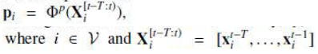

# Introduction
- rapid growth of multimedia platforms(news outlets and social media) ➡️ comprehensive evaluations about identifing potential investment
- real-world investment: subtle insights from financial news ➡️ significant profit indicators
- stock price signals inherently contain randomness(랜덤 워크 이론) ➡️ predicting the deterministic component(예측 가능한 요소) brought about by news
- two feature modalities in financial time-series forecasting
  - multivariate time-series features
    - opening price, closing price, and volume
  - discrete tabular features
    - technical indicators calculated based on historical trading signals
      - 가격·거래량 등 시계열 데이터를 기반으로 일정한 계산식(공식)을 적용하여 도출된 숫자형 요약 지표들
      - MA (이동평균선): 일정 기간 동안의 평균 가격. 상승/하락 추세 식별
      - MACD: 장·단기 이동 평균선 간 차이를 통해 추세 전환 포착
      - 왜 "이산형(discrete)"일까?
        - 하루 단위, 혹은 특정 윈도우(5일, 14일, 30일 등)를 기준으로 하나의 고정된 수치 값을 출력
        - 연속적인 시계열이 아닌, 고정된 시점에서의 하나의 값으로써 **이산적(discrete)
  - underlying assumption: trading signals for all stocks are mutually exclusive
    - 기존 연구들이 주식 간의 **상호작용(interaction)**을 무시하고 있다는 점을 비판
  - all stocks belong to the same financial system ➡️ each stock is inevitably affected by peer stocks
    - Why? momentum spillover effect(모멘텀 전이 효과)
      - factor movement:주식 수익률에 영향을 주는 공통 요인(Market factor, Value, Growth, Small/Big, Momentum)이 변하면서 개별 주식 또는 여러 섹터에 영향을 미침
      - lead-lag effect: 한 자산(또는 지표)의 가격 움직임이 시간적으로 선행(lead)하고, 다른 자산이 뒤따라서 반응(lag)하는 현상
        - t: 기술주 ETF 급등 ➡️ t+1: 삼성전자 상승
      - portfolio rebalancing: ETF나 기관 포트폴리오의 리밸런싱 ➡️ 포함된 여러 종목에 동시적으로 매수 또는 매도 압력
    - 현실에서는 주식 간 다음과 같은 상관관계(correlation) 또는 **영향 전이(spillover)**가 존재
      - 삼성전자 주가 상승 → SK하이닉스 주가도 반응
      - 테슬라 실적 발표 → LG에너지솔루션 영향
- advent of graph neural networks (GNNs): conceptualized the stock market as a complex network to model peer interactions
  - node: each stock
  - edge: relationship which is hard-coded microstructure
    - time-series correlation, supply chain, news co-occurrence
    - 학습을 통해 자동으로 만들어진 게 아니라, 기존의 외부 지식이나 규칙에 따라 미리 고정된 방식으로 구성
- static GNN structure: struggles to adapt to the dynamics of the real-world financial market
- graph attention networks (GATs): attempt to model adaptive interactions between stocks as stock attention networks
  - a long-tailed feature distribution in Real-world financial data for algorithmic trading
    - 소수의 종목은 매우 풍부한 정보를 가지고 있지만, 대부분의 종목은 거의 정보가 없는 불균형한 분포
    - 일부 인기 종목에 뉴스·데이터가 몰려 있고, 대부분의 종목은 정보가 거의 없음
  - Figure 1: Example of the long-tailed feature distribution
    - the news (known as tail features) dynamically covers only a fraction of stocks
    - investment insights from news may be overwhelmed by massive price-related head features
    - a biased attention effect: Breaking news from the financial sector that impact the overall stock market receive insufficient cross-sector attention.
      - 이러한 뉴스는 다른 섹터들로 충분히 확산되지 못함
- two main challenges
  - 1. the long tail effect in feature distribution(feature imbalanced problem)
    - bias toward the dominated head features
  - 2. resampling is not effective to overcome feature unbalance
    - why? future market landscapes are diverse and intricate
- turning point
  - events that affect specific stocks ➡️ an instantaneous dominance over their movements
    - But, few studies incorporated it into the model
  - near-equivalence between news and stock price movements
    ➡️ new resampling strategy: bypasses news and directly generates large amounts of putative(추정되는) news sentiments (treated as news) from stock price movements (labels) for data augmentation. 
  - graph attention mechanism to be pretrained
    ➡️ adapt to more complex and extreme news coverage
    ➡️ improving the model's generalization performance and addressing the long-tail feature distributions overlooked by existing methods.
  - redesign of the attention model architecture and the training strategy ➡️ seamless integration of pretraining and fine-tuning
    - simultaneously accommodate both news information and the generated putative news
    - transform the news into potential stock movements (or news sentiments)
- propose: prompt-adaptive trimodal model (PA-TMM)
  - prompt: 다른 종목들의 뉴스 감성이나 움직임을 요약한 벡터
  - designing two subnetworks
    - cross-modal fusion module: integrating trimodal features and extracting the news-induced sentiments as prompts for other stocks
    - graph dual-attention module: dynamically inferring the stock attention network by a graph dual-attention mechanism
      - circumvents(우회) direct similarity measurement of heterogeneous(서로 다른) representations(news, prices)
      - overcome biased attention
  - an equivalence resampling (EQSamp) strategy
    - tackle the tail feature scarcity problem
    - data augmentation by establislng a direct connection between market sentiments in news and stock movements by considering the dominant impact of news
  - pretrain our model using augmented data with generated prompts
    - proactively adapting to extreme feature unbalance
  - fine-tune the model with real-world data
    - mainly focusing on understanding news representations
- contributions
  - a learning framework named PA-TMM: effectively captupes news propagation dynamics by graph learning
  - targeted pretraining method named movement prompt adaptation (MPA)
    - respond to tai led news sensitively
    - prevents it from overfitting due to over-reliance on stocks canying news
  - EQSarnp strategy
    - financial data augmentati on when pretraining to overcome the news scarcity problem
    - enhancing tl1e generalization ability of GNNs on feature-imbalanced datasets
# Related Work
## Time-Series Stock Prediction
- encoding an individual stock ➡️ a sequential latent representation ➡️ downstream tasks
  - RNNs based: LSTM, GRU, Transformer
  - capture the underlying tune-varying patterns from multiple time steps
- encode the time series for each stock using RNNs
  - PEN [40], MAN-SF [12], and MTR-C [41]
- mningling different types of market factors
  - relational event-driven stock trend forecasting (REST) [44]
    - utilizes the event information from the company's announcements
- produce powerful high-frequency stock factors
  - Digger-Guider [45]
  - significantly improve stock trend prediction performance
- But, 여전히 문제가 되는 Assumption
  - the trading signals of all stocks are mutually exclusive
  - Why? financial markets are highly internally coupled, momentum spillover
## Graph-Based Stock Prediction
- 시장 현실: the movement of each entity is inevitably in fluenced by its peer entities [46]
  - a lead-lag effect in the stock market
- conceptualize the stock market as a graph
  - To model this intraindustry phenomenon
  - node: each entity
  - edges: relations
    - industry category [2], supply chain [23], business partnership [6], price correlation [3], lead-lag correlation [2], and causal effect [21]
- GNNs
  - THGNN [3] generates a temporal and heterogeneous graph for graph aggregation operation. ESTIMATE [2], utilizin g hypergraphs based on industry classifications, captures nonpairwise correlations among stocks. SAMBA [49] models dependencies between daily stock features by utilizing a bidirectional Mamba block and an adaptive graph convolution module
  - THGNN [3]: 하이퍼그래프를 통해 시간 및 관계 기반 특성을 통합
  - ESTIMATE [2]: 하이퍼그래프 및 웨이블릿 attention을 통해 주식 간 상관관계 포착
  - SAMBA [49]: 양방향 Mamba 블록 및 적응형 그래프 합성 모듈을 활용
- aggregating peer influences ➡️ update node representations to capture neighbor-induced movement
## News-Based Stock Prediction
- financial news [40], [50], [51] or social media posts [7], [20]
  - external information beyond the trading market
- the graph convolutional networks (GCNs)
  - multi-source aggregated classification (MAC) [l]
  - aggregate the effects of news on related companies
- aggregate various features such as technical indicators and textual news
  - NumHTML [52] and multi-view fusion network (MFN) [53]
- adapt to the market dynamics: combining stock interactions and news information
    - using time series of prices, market sentiments from news, etc
      - AD-GAT(Graph Attention Technic) [15] and DANSMP [6]
    - balances complementarity and redundancy across modalities
      - Multi-scale multi-modal fusion (MSMF) [54]: integrating the modality completion encoder, multiscale feature extractor, and fusion mechanism.
- But, 여전한 문제
  - lack of consideration for the long-tail effect
  - silmply concatenate features from different modalities
  - difficult to fully and effectively leverage news information and model the propagation of news impact within stock networks
- 해결 방안
  - propose a pretraining strategy for GATs in finance
  - enables the model to proactively adapt to the imbalanced feature distribution
  - enhancing the generalizability
# Problem Statement
- a classification method optimized through an objective function for classification
   -  predicting the exact value of stock prices is far more challenging than predicting price movements
   - outputting a class label that indicates the rise or fall of stocks
   - comparing whether the stock price on the current trading day is higher than that of the previous trading day
   - leverage trimodal features on the (t−1)th day as input features to predict the movements (labels)
   - 
- three feature modalities
  - 1. textual news corpora T
    - labeled the relevant stocks impacted by each news item
  - 2. historical time-series trading signals
    -  from past T trading days
    - 
      - transaction features of stock i on the Tth day
      - the highest and lowest price, opening and closing price, trade volume, and rankings of these values over 5 days, 20 days, and 60 days
  - 3. tabular(테이블 형식) technical indicators
    - 
    - Moving Average Indicators: smooth price signals over time to identify trends and patterns inherent in price movement
    - Momentum Indicators: evaluate the strength and speed of price changes and detect potential trend reversals or continuations
    - Volatility Indicators: quantify the price volatility and gauge the level of risk in the market
    - Volume Indicators: assess the relationship between price and tracting volume and identify the accumulation or distribution of a security
- 목표
  - integrate trunodal features + acco,runodate the long-tailed feature distribution

# PA-TMM Architecture
- key motivation: dealing with the long tail effect in feature distribution
- consists of two subnetworks
  - cross-modal fusion module
    - tackles the missing textual modality
    - integrates cross-modal information
    - automatically generating news sentiments and hybrid stock representations
  - graph dual-attention module
    - dynamically infers a partial-bipartite stock attention network
    - considering the news- and price-induced interactions separately
## A. Cross-Modal Fusion Module
- cross-stream architecture
  - address the missing textual modality
    - 서로 다른 데이터 흐름(뉴스, 주가, 지표 등)을 나란히 처리하고 결합하는 구조
  - generate sentiment prompts for other stocks
  - integrate trimodal information including time series (trading signals), tabular features (technical indicators), and natural languages (textual news)
### 1) Pseudo-News Padding and Activation State
- news may be absent for certain stocks on a given day
  - fill the news position with pseudo-news
  - differentiate pseudo-news from the real news
    - mutually exclusive subsets on the day 𝑡
    - a nonactivation subset 𝑉⁽⁰⁾
      - 𝑖 ∈ 𝑉⁽⁰⁾: stock 𝑖 contains price-only information
    - an activation subset 𝑉⁽¹⁾
      - 𝑖 ∈ 𝑉⁽¹⁾: the presence of real news
### 2) Representation Learning
- trimodal features ➡️ representations for each stock
- textual news
  - pretrained language model BERT [55]를 이용, feature extractor
  - encode the lth textual sequence into a vector
    - 
  - news representation: the average of all these embeddings belonging to the same stock
    - 
    - L: the number of stock-specific news on the target trading day
- time-series trading signals
  - the bidirectional LSTM (Bi-LSTM)
    - encode the time-series trading signals into a vector
    - 
    - capture the trading context of each stock
  - concatenating historical trading signals
    - 
- technical indicators
  - TabNet encoder
    - 
    - the tabular features ➡️ a continuous vector space
  - 
- 최종 결과: two movement
  - news-induced movement: knowledge contained within mᵢ ∈ ℝᵈⁿ 
  - price-induced movement: knowledge contained within both pᵢ ∈ ℝᵈᵖ and qᵢ ∈ ℝᵈᵠ
### 3) Modal Decomposition
- news-related information + price-related information ➡️ trimodal representations
- four different spaces
  - news-stream integration
    - 1) modal-specific feature extraction
    - 2) modal-shared feature extraction
  - price-stream integration
    - 3) modal-specific feature extraction
    - 4) modal-shared feature extraction
  - modal-specific feature: 특정 종목에 대한 특징
  - modal-shared feature: 시장 또는 섹터 전반에 대한 특징
  - 
  
| 기호                            | 의미                       |
| -------------------------------- | ------------------------ |
| $m_i$                            | 뉴스 임베딩 벡터 (BERT 기반)      |
| $p_i$                            | 시계열 가격 벡터 (Bi-LSTM 기반)   |
| $q_i$                            | 기술 지표 벡터 (TabNet 기반)     |
| $[p_i \| q_i]$                   | 가격 정보와 기술 지표를 이어붙인 벡터    |
| $\sigma$                         | 비선형 활성화 함수 (예: ReLU)     |
| $u_i^m \in \mathbb{R}^{d_r}$     | 뉴스 전용(news-specific) 표현  |
| $v_i^m \in \mathbb{R}^{d_r}$     | 뉴스 공유(news-shared) 표현    |
| $u_i^p \in \mathbb{R}^{d_r}$     | 가격 전용(price-specific) 표현 |
| $v_i^p \in \mathbb{R}^{d_r}$     | 가격 공유(price-shared) 표현   |
| $W$ | 학습 가능한 선형 변환 가중치 행렬      |
- $W$ shape
  - $W_{um} \in \mathbb{R}^{d_r \times d_m}$
  - $W_{vm} \in \mathbb{R}^{d_r \times d_m}$
  - $W_{up} \in \mathbb{R}^{d_r \times (d_p+d_q)}$
  - $W_{vp} \in \mathbb{R}^{d_r \times (d_p+d_q)}$
- orthogonal loss
  - 
  - ensure the independence of the decomposed modal-specific spaces from the modal-shared spaces ➡️ orthogonal constraint
  - 이 손실 함수는 위 가중치 행렬들을 서로로 내적한 행렬의 Frobenius Norm(전체 요소의 에너지)을 최소화 ➡️ 특화 표현과 공유 표현이 서로 겹치지 않도록 (즉, 직교하도록) 만듦 ➡️ 강제 분리: modal-shared feature와 modal-specific feature가 서로 다른 정보를 담도록
  - 없다면? shared vector와 specific vector가 같은 정보를 학습할 수 있음
### 4) Modal Integration
- modern behavioral finance theory [6], [57], [58]
  - investors are considered irrational and often swayed by opinions expressed in the media
  - Media sentiment: investors' expectations ➡️ stock price movements
- news-stream integration for $h_i^{pmt}$
  - capture the news-driven sentiment prompts
  - 
    - $u_i^m \odot v_i^p$
      - news-specific vector와 price-shared vector 의 원소별 곱 (element-wise product) ➡️ 상호작용 반영
      - news: the primary carrier of sentiment
      - price-shared information: gate for filtering out noise in the news ➡️ multiplication operation
    - $u_i^m||(u_i^m \odot v_i^p)||v_i^p$: 세 백터 연결
    - $W_{zr} \in \mathbb{R}^{2 \times 3d}$: 2차원 감성 출력을 위한 학습된 선형 변환 행렬
  - $h_i^{pmt} \in \mathbb{R}^2$: 해당 종목이 긍정적인 감성에 속할지, 부정적인 감성에 속할지를 확률 분포로 출력
    - ➡️ **뉴스 감성을 양극(positive vs negative)**으로 분류한 2차원 감성 프롬프트
- aligns with the MPA(Movement Prompt Adaptation) strategy
  - enhances our model's generalization performance
- price-stream integration for $h_i^{hyb}\in \mathbb{R}^{d_h}$
  - serves as the stock representation
  - 
  - price and shared news information are equally crucial ➡️ addition operation
## B. Graph Dual-Attention Module
- momentum spillover effects from related stocks
- imbalance of feature distribution
  - circumvent direct aggregation
  - uniformity of node representations 을 적용할 수 없기 때문(노드가 갖는 정보량이나 modality가 다르더라도 구분 없이 동일한 선형변환을 사용)
- design a graph dual-attention module
  - encode the exchanged heterogeneous information among stocks
### 1) Stock Polarized Activation
- asymmetry feature distribution ➡️ stocks with news (activated stocks) will carry more fundamental information beyond the market
- different activation states ➡️ different stocks influence one another in different ways
- embed activated and nonactivated stocks separately ➡️ distinguishing between real news and pseudo-news
- 
  - activated nodes: prompts and hybrid embeddings
  - nonactivated nodes: onl y hybrid embeddings
- cosine distance to measure tbe polarization loss of them
  - activated nodes with opposing sentiments: alienated
  - those with the same sentiment: closer
  - 
    - sign function: discerns whether nodes i and j share the same sentiment
      - positive(+1) if nodes i and j share the same sentiment polarity ➡️ minimization of their distance cost
      - negative(-1) if not
      - $\hat{h_i^+}, \hat{h_i^-}$: 확률로 0과 1사이의 값을 가지며, 둘이 더하여 1이 됨
      - $\hat{h_i^+}- \hat{h_i^-}$: 양수면 긍정이 우세, 음수면 부정이 우세
      - $(\hat{h_i^+}- \hat{h_i^-})\cdot(\hat{h_j^+}- \hat{h_j^-})$
        -  i와 j의 sentiment가 같은 방향으로 움직이면 결과가 양수, 다른 뱡향으로 움직이면 음수
      - $sgn(x)$
        - x > 0 이면 +1 반환
        - x < 0 이면 -1 반환
        - x = 0 이면  0 반환
    - $cos(n_i, n_j)$
       - 코사인 유사도는 두 벡터 사이의 방향 유사도를 측정
       - $\cos(\mathbf{n}_i, \mathbf{n}_j) = \frac{\mathbf{n}_i \cdot \mathbf{n}_j}{\|\mathbf{n}_i\| \|\mathbf{n}_j\|}$
         - 두 벡터의 내적값을 두 벡터의 노름으로 나눈값
         - -1 에서 +1 사이의 값을 갖음
         - +1은 매우 유사, 0은 무관, -1은 정반대
     - $L_{pol}$
       - minimization of polarization loss:
         - opposite sentiments ➡️ separated
         - similar sentiments ➡️ closer
### 2) Interaction inference
- Stocks often interact dynamically based on real-ti1ne market movements
- a graph dual-attention mechanism
  - capture the full complexity of these relationships
  - reflecting the flow of information between nodes
- onactivated stocks: restrict the information exchange 
  - between activated and nonactivated stocks： activated ➡️ nonactivate(반대 방향은 없음)
  - among nonactivated stocks themselves: 일부 노드끼리만 연결됨
- partially bipartite GAN
  - 
    - 감성 프롬프트를 가진 종목 𝑉(1)의 정보를 뉴스가 없는 종목 𝑉(0)에 전달하고자 하기 때문
  - 
    - $i$: target node, $j$: source node
    - $\alpha^{(1)}$: nonactivated node(i)가 actvated node(j) 로부터 받는 가중치
    - $\alpha^{(0)}$: nonactvated node(i)가 nonactivated(j) 로부터 받는 가중치
    - 
      - 노드 벡터 간의 상호작용 함수
      - Graph Attention Mechanism (GAT)에서 자주 쓰이는 attention score 계산 함수
      - estimates the message flux(전달량) for every node pair(연결된 노드) ➡️ more expressive in handling partial-bipartite graphs
      - LeakyReLU: ReLU의 변형으로, 0 이하 입력도 완전히 죽이지 않음
      - $a_{\phi}$: attention score 생성을 위한 weight vector
      - $a_{\phi}^T\cdot ()$: 최종적으로 **attention score(스칼라)**를 생성하기 위한 선형 조합
### 3) Information Exchange
- every stock is influenced by both news- and price-driven movements
- activated stock: breaking news often dominates price movements
- nonactivated stock: interactions it receives from peer stocks can be aggregated into a message vector
  - $\tilde{m}_i \in \R^{2d_e}$: 노드 𝑖는 뉴스 정보와 가격 정보가 유입되는 노드들로부터 두 종류의 정보를 받아 aggregate한 뒤 concatenate
  - $$\tilde{\mathbf{m}}_i = \mathbin\Vert_{k \in \{0, 1\}} \sigma\left( \sum_{j \in \mathcal{V}^{(k)}(i)} \alpha_{i,j}^{(k)} \mathbf{e}_{i,j} \right)$$
    - $\tilde{m}_i$: **노드 i**에 대해 이웃 노드들로부터 받은 메시지를 집계한 최종 message vector
    - $\alpha_{i,j}^{(k)}$: 노드 𝑗 → 노드 𝑖 로의 attention weight (normalized importance)
      - governing the strength of the strength of the connection
    - $\mathbf{e}_{i,j}$: 노드 𝑗 → 노드 𝑖로 전달되는 메시지 (edge representation)
      - $$\mathbf{e}_{i,j} = \mathbf{W}_{eo} \left[ \mathbf{n}_i \mathbin\Vert \sigma \left( \mathbf{W}_{on} \left[ \mathbf{n}_i \mathbin\Vert \mathbf{n}_j \right] \right) \mathbin\Vert \mathbf{n}_j \right]$$
        - 두 노드의 임베딩을 기반으로 노드 간 상호작용 메시지를 생성(encapsulates the information flow)
          - 단순한 임베딩이 아니라, 두 노드 사이의 상호작용을 내포한 stock-to-stock 메시지 표현(encodes the stock-to-stock interaction into a stock-sensitive representation)
        - $\mathbf{W}_{on} \in \R^{d\times 2d}$: 첫 번째 변환 weight (MLP)
        - $\mathbf{W}_{eo} \in \R^{d\times 3d}$: 최종 메시지 생성용 weight
    -  $\mathbf{e}_{i,j}$는 attention score인 $\alpha_{i,j}^{(k)}$로 가중합되어 노드 i 로 전달됨
### 4) Output Mapping
- nonactivated stocks
  - $\hat{y_i} \in \R^2$
    - = $[\hat{y_i^-}||\hat{y_i^+}]=softmax(W_i[n_i||\tilde{m_i}]+b_i)$
      - $W_i\in \R^{2\times (d_n+2d_e)}$, $b_i\in \R^2$
- activated stock
  - predicted price movement: the extracted sentiment prompts $h_i^{pmt}=[\hat{h_i^-}||\hat{h_i^+}]$
### 5) Discussion
- conventional graph attention mechanism: homogeneous graphs
- graph dual-attention module: partially bipartite
  - Ablation experiments: removing the message vectors ➡️ degrades model performance
  - crucial to differenciate two types of attention scores($\alpha_{i,j}^{(0)}$, $\alpha_{i,j}^{(1)}$)
  - increase computational complexity
## C. Computational Complexity
- Part1: The cross-modal fusion module
  - primary cost: recurrent component of the LSTM
    - a complexity of $O(N\times T\times d_p^2)$
      - $N$: the number of stocks
      - $T$: the length of the time series
      - $d_p$: the hidden size of LSTM
  - negligible cost: linear layers
    - modal decomposition, modal integration
- Part2: The graph dual-atten tion module
  - primary cost: interactions inference
    - computing the unidirectional interactions between all pairs of nodes
    - a complexity of $O(N^2\times d_n)$
      - $d_n$: the dimension of the node vector
  - negligible cost: linear layers
- Overall complexity
  - $O(N\times T\times d_p^2) + O(N^2\times d_n)$
  - Thus, need to control the scale of the stock network
    - excessive node interactions can lead to increased computational costs
# Model Optimization
- two-stage optimization method
- A. MPA
  - data augmentation strategy for extensive pretraining
  - EQSamp: capturing news information by the graph dual-attention module
- B. Fine-Tuning
  - using real news data
## A. Model Pretraining: MPA
- stocks with daily news coverage are rare
  - long tail effect in feature distribution
  - easily distracted by the abundance of price features
### 1) Equivalence Resampling
- The market conditions reflected in historical data may not necessarily correspond to future market states
- propose the EQSamp strategy
  - augmenting data in stock market datasets ➡️ adapt to the long-tail effects of features ➡️ accommodate a wide range of possible scenarios
  - establisbes an equivalence between market sentiments in news and stock movements
  - generate prompts directly via EQSrunp
- Process
  - begin by randomly activating a stock subset $V^{(1)}\subset V$
    - set size is dynamically adjusted ➡️ emulate daily changes in the number of stocks that carry news
  - the quantity-varying process of stocks with news
    - counting their number within a unit of time
    - using a Poisson process
      - 
      - 단위 시간 또는 단위 공간 내에서 어떤 사건이 몇 번 발생하는지를 모델링
      - k: 사건 발생 횟수
        - 하루에 뉴스가 있는 종목 수
      - 𝜆: 단위 시간/공간에서 평균 발생 횟수
        - maximum likelihood estimation로 결정
  - assign them movement prompts based on their ground-truth movements(각 주식의 실제 등락 정보)
    - equivalent surrogate(대체물) for news sentiments
    - 
    - $\epsilon_i$: follows a uniform distribution $U(0, 0.5)$
      - 프롬프트에 **무작위 신뢰도 요소(random confidence)**를 추가하여 **강건성(robustness)**을 확보
  - prevent the model from over-fitting due to over-reliance on activated nodes
    - a strategy of inverting movement prompts(실제 등락 정보로 생성된 이진 벡터터) with a mutation probability $\theta$(일정 확률로 반전)
    - $h_i^{pmt}$ ⬅️ $1-h_i^{pmt}$: 1은 0이 되고, 0은 1이 됨
    - 일종의 "데이터 노이즈 주입(data noise injection)" 전략
    - 과적합을 방지하고 일반화 성능을 향상
- worth noting 
  - perform multiple samplings to obtain numerous different activable subsets for a single day to augment the pretraining data

### 2) Pretraining Objectives
## B. Model Fine-Tuning
# Experiments
## Evaluation Setup
## Stock Movement Prediction
## Ablation Study
## Backtesting Profitability
## Stress Test During Market Crash
## Parameter Sensitivity Analysis
## Case Study on Exploring Stock Attention Networks
# Conclusion