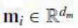

# Introduction
- rapid growth of multimedia platforms(news outlets and social media) ➡️ comprehensive evaluations about identifing potential investment
- real-world investment: subtle insights from financial news ➡️ significant profit indicators
- stock price signals inherently contain randomness(랜덤 워크 이론) ➡️ predicting the deterministic component(예측 가능한 요소) brought about by news
- two feature modalities in financial time-series forecasting
  - multivariate time-series features
    - opening price, closing price, and volume
  - discrete tabular features
    - technical indicators calculated based on historical trading signals
      - 가격·거래량 등 시계열 데이터를 기반으로 일정한 계산식(공식)을 적용하여 도출된 숫자형 요약 지표들
      - MA (이동평균선): 일정 기간 동안의 평균 가격. 상승/하락 추세 식별
      - MACD: 장·단기 이동 평균선 간 차이를 통해 추세 전환 포착
      - 왜 "이산형(discrete)"일까?
        - 하루 단위, 혹은 특정 윈도우(5일, 14일, 30일 등)를 기준으로 하나의 고정된 수치 값을 출력
        - 연속적인 시계열이 아닌, 고정된 시점에서의 하나의 값으로써 **이산적(discrete)
  - underlying assumption: trading signals for all stocks are mutually exclusive
    - 기존 연구들이 주식 간의 **상호작용(interaction)**을 무시하고 있다는 점을 비판
  - all stocks belong to the same financial system ➡️ each stock is inevitably affected by peer stocks
    - Why? momentum spillover effect(모멘텀 전이 효과)
      - factor movement:주식 수익률에 영향을 주는 공통 요인(Market factor, Value, Growth, Small/Big, Momentum)이 변하면서 개별 주식 또는 여러 섹터에 영향을 미침
      - lead-lag effect: 한 자산(또는 지표)의 가격 움직임이 시간적으로 선행(lead)하고, 다른 자산이 뒤따라서 반응(lag)하는 현상
        - t: 기술주 ETF 급등 ➡️ t+1: 삼성전자 상승
      - portfolio rebalancing: ETF나 기관 포트폴리오의 리밸런싱 ➡️ 포함된 여러 종목에 동시적으로 매수 또는 매도 압력
    - 현실에서는 주식 간 다음과 같은 상관관계(correlation) 또는 **영향 전이(spillover)**가 존재
      - 삼성전자 주가 상승 → SK하이닉스 주가도 반응
      - 테슬라 실적 발표 → LG에너지솔루션 영향
- advent of graph neural networks (GNNs): conceptualized the stock market as a complex network to model peer interactions
  - node: each stock
  - edge: relationship which is hard-coded microstructure
    - time-series correlation, supply chain, news co-occurrence
    - 학습을 통해 자동으로 만들어진 게 아니라, 기존의 외부 지식이나 규칙에 따라 미리 고정된 방식으로 구성
- static GNN structure: struggles to adapt to the dynamics of the real-world financial market
- graph attention networks (GATs): attempt to model adaptive interactions between stocks as stock attention networks
  - a long-tailed feature distribution in Real-world financial data for algorithmic trading
    - 소수의 종목은 매우 풍부한 정보를 가지고 있지만, 대부분의 종목은 거의 정보가 없는 불균형한 분포
    - 일부 인기 종목에 뉴스·데이터가 몰려 있고, 대부분의 종목은 정보가 거의 없음
  - Figure 1: Example of the long-tailed feature distribution
    - the news (known as tail features) dynamically covers only a fraction of stocks
    - investment insights from news may be overwhelmed by massive price-related head features
    - a biased attention effect: Breaking news from the financial sector that impact the overall stock market receive insufficient cross-sector attention.
      - 이러한 뉴스는 다른 섹터들로 충분히 확산되지 못함
- two main challenges
  - 1. the long tail effect in feature distribution(feature imbalanced problem)
    - bias toward the dominated head features
  - 2. data scarcity problem
    - leading to the poor generalization
    - resampling is not effective to overcome feature unbalance(replicate of the dataset)
    - why? future market landscapes are diverse and intricate
- turning point
  - events that affect specific stocks ➡️ an instantaneous dominance over their movements
    - But, few studies incorporated it into the model
  - near-equivalence between news and stock price movements
    ➡️ new resampling strategy: bypasses news and directly generates large amounts of putative(추정되는) news sentiments (treated as news) from stock price movements (labels) for data augmentation. 
  - graph attention mechanism to be pretrained
    ➡️ adapt to more complex and extreme news coverage
    ➡️ improving the model's generalization performance and addressing the long-tail feature distributions overlooked by existing methods.
  - redesign of the attention model architecture and the training strategy ➡️ seamless integration of pretraining and fine-tuning
    - simultaneously accommodate both news information and the generated putative news
    - transform the news into potential stock movements (or news sentiments)
- propose: prompt-adaptive trimodal model (PA-TMM)
  - prompt: 다른 종목들의 뉴스 감성이나 움직임을 요약한 벡터
  - designing two subnetworks
    - cross-modal fusion module: integrating trimodal features and extracting the news-induced sentiments as prompts for other stocks
    - graph dual-attention module: dynamically inferring the stock attention network by a graph dual-attention mechanism
      - circumvents(우회) direct similarity measurement of heterogeneous(서로 다른) representations(news, prices)
      - overcome biased attention
      - (What is Graph Dual-Attention?)
        - Node-level Attention 뿐만 아니라, Feature-level Attention을 같이 적용
        - 즉, 노드 간의 중요성과 특선 간의 중요성을 같이 고려
        - 즉, **"누구로부터 어떤 정보를 얼마나 받아들일 것인가"**를 이중으로 판단하는 구조
  - an equivalence resampling (EQSamp) strategy
    - tackle the tail feature scarcity problem
    - data augmentation by establislng a direct connection between market sentiments in news and stock movements by considering the dominant impact of news
  - pretrain our model using augmented data with generated prompts
    - proactively adapting to extreme feature unbalance
  - fine-tune the model with real-world data
    - mainly focusing on understanding news representations
- contributions
  - a learning framework named PA-TMM
    - heterogeneous modality fosion
    - effectively captupes news propagation dynamics by graph learning
  - targeted pretraining method named movement prompt adaptation (MPA)
    - respond to tailed news sensitively
    - prevents it from overfitting due to over-reliance on stocks carrying news
  - EQSarnp strategy
    - financial data augmentation when pretraining to overcome the news scarcity problem
    - enhancing the generalization ability of GNNs on feature-imbalanced datasets
# Related Work
## Time-Series Stock Prediction
- encoding an individual stock ➡️ a sequential latent representation
  - RNNs based: LSTM, GRU, Transformer
  - capture the underlying time-varying patterns from multiple time steps
- encode the time series for each stock using RNNs
  - PEN [40], MAN-SF [12], and MTR-C [41]
- mningling different types of market factors
  - relational event-driven stock trend forecasting (REST) [44]
    - utilizes the event information from the company's announcements
- produce powerful high-frequency stock factors
  - Digger-Guider [45]
  - significantly improve stock trend prediction performance
- But, 여전히 문제가 되는 Assumption
  - the trading signals of all stocks are mutually exclusive
  - Why? financial markets are highly internally coupled, momentum spillover
## Graph-Based Stock Prediction
- 시장 현실: the movement of each entity is inevitably in fluenced by its peer entities [46]
  - a lead-lag effect in the stock market
- conceptualize the stock market as a graph
  - To model this intraindustry phenomenon
  - node: each entity
  - edges: relations
    - e.g., industry category [2], supply chain [23], business partnership [6], price correlation [3], lead-lag correlation [2], and causal effect [21]
- GNNs
  - THGNN [3]: generates a temporal and heterogeneous graph for graph aggregation operation.
  - ESTIMATE [2]: utilizing hypergraphs based on industry classifications, captures nonpairwise correlations among stocks
  - SAMBA [49]: models dependencies between daily stock features by utilizing a bidirectional Mamba block and an adaptive graph convolution module
  - THGNN [3]: 하이퍼그래프를 통해 시간 및 관계 기반 특성을 통합
  - ESTIMATE [2]: 하이퍼그래프 및 웨이블릿 attention을 통해 주식 간 상관관계 포착
  - SAMBA [49]: 양방향 Mamba 블록 및 적응형 그래프 합성 모듈을 활용
- 효과성 of graph-based method
  - aggregating peer influences ➡️ update node representations to capture neighbor-induced movement
## News-Based Stock Prediction
- the advancement of multunedia technology ➡️ integrating external information beyond the trading market
  - financial news [40], [50], [51] or social media posts [7], [20] 
- 시도1: the graph convolutional networks (GCNs)
  - multi-source aggregated classification (MAC) [l]: aggregate the effects of news on related companies
  - NumHTML [52] and multi-view fusion network (MFN) [53]: aggregate various features such as technical indicators and textual news
- 시도2: GAT
  - 목적: adapt to the market dynamics ⬅️ combining stock interactions and news information
  - AD-GAT(Graph Attention Technic) [15] and DANSMP [6]: using time series of prices, market sentiments from news, etc ➡️ adjust or infer the edges
- 시도3: Multi-modal
  - Multi-scale multi-modal fusion (MSMF) [54]: integrating the modality completion encoder, multiscale feature extractor, and fusion mechanism ➡️ balances complementarity and redundancy across modalities
  - evolving from a unimodal to a multimodal paradigm
- But, 여전한 문제
  - lack of consideration for the long-tail effect
  - silmply concatenate features from different modalities
  - difficult to fully and effectively leverage news information and model the propagation of news impact within stock networks
- 해결 방안
  - propose a pretraining strategy for GATs in finance
    - enables the model to proactively adapt to the imbalanced feature distribution
    - enhancing the generalizability
# Problem Statement
- a classification method for optimizatoin
  - In the stock market, predicting the exact value of stock prices is far more challenging than predicting price movements
  - an objective function
    - 
    - outputting a class label that indicates the rise or fall of stocks
    - comparing whether the stock price on the current trading day is higher than that of the previous trading day 
- three feature modalities
  - leverage trimodal features on the (T−1)th day as input features to predict the movements on the the Tth day 
  - 1. textual news corpora T
    - labeled the relevant stocks impacted by each news item
  - 2. historical time-series trading signals
    -  from past T trading days
    - 
      - transaction features of stock i on the Tth day
      - the highest and lowest price, opening and closing price, trade volume, and rankings of these values over 5 days, 20 days, and 60 days
    - standardize the price values of each stock ➡️ address varying price levels
  - 3. tabular(테이블 형식) technical indicators
    - 
    - computed through the technical analysis of historical trading signals
    - Moving Average Indicators: smooth price signals over time to identify trends and patterns inherent in price movement
    - Momentum Indicators: evaluate the strength and speed of price changes and detect potential trend reversals or continuations
    - Volatility Indicators: quantify the price volatility and gauge the level of risk in the market
    - Volume Indicators: assess the relationship between price and tracting volume and identify the accumulation or distribution of a security
- 목표
  - integrate trimodal features + accomodate the long-tailed feature distribution(only a few stocks have relevant news)

# PA-TMM Architecture
- key motivation: dealing with the long tail effect in feature distribution
- consists of two subnetworks
  - cross-modal fusion module
    - tackles the missing textual modality
    - integrates cross-modal information
    - automatically generating news sentiments and hybrid stock representations
  - graph dual-attention module
    - dynamically infers a partial-bipartite stock attention network
    - considering the news- and price-induced interactions separately
## A. Cross-Modal Fusion Module
- cross-stream architecture
  - address the missing textual modality
    - 서로 다른 데이터 흐름(뉴스, 주가, 지표 등)을 나란히 처리하고 결합하는 구조
  - generate sentiment prompts for other stocks
  - integrate trimodal information including time series (trading signals), tabular features (technical indicators), and natural languages (textual news)
### 1) Pseudo-News Padding and Activation State
- news may be absent for certain stocks on a given day
  - fill the news position with pseudo-news(i.e., a space character) ➡️ address the issue of modality incompleteness with flexibility
  - differentiate pseudo-news from the real news
    - mutually exclusive subsets on the day 𝑡
    - a nonactivation subset 𝑉⁽⁰⁾
      - 𝑖 ∈ 𝑉⁽⁰⁾: stock 𝑖 contains price-only information
    - an activation subset 𝑉⁽¹⁾
      - 𝑖 ∈ 𝑉⁽¹⁾: the presence of real news
### 2) Representation Learning
- trimodal features ➡️ representations for each stock
- textual news
  - encode the lth textual sequence into a vector
    - 
  - feature extractor: pretrained language model BERT [55]
    - 
  - news representation: the average of all these embeddings belonging to the same stock
    - 
    - L: the number of stock-specific news on the target trading day
  - news-induced movement
    - 
- time-series trading signals
  - the bidirectional LSTM (Bi-LSTM)
    - encode the time-series trading signals into a vector
    - 
  - capture the trading context of each stock
    - 
    - $i \in V$
    - $X_i^{[t-T:t]}=[X_i^{t-T},...,X_i^{t-1}]$: matrix concatenating historical trading signals
- technical indicators
  - TabNet encoder
    - 
    - the tabular features ➡️ a continuous vector space
  - 
- 최종 결과: two movement
  - news-induced movement: $m_i\in \R^{d_m}$
  - price-induced movement
    - time-series trading context: $p_i\in \R^{d_p}$
    - tabular feature matrix: $q_i\in \R^{d_q}$
### 3) Modal Decomposition
- Fuse trimodal representations
  - news-related information, price-related information ➡️ project into four different spaces(선형변환한 것이라고 볼 수 있음, 모든 사영은 선형변환이지만, 모든 선형변환이 사영은 아님)
    - 입력 행렬을 다른 공간에 직각적으로 투사하는 것을 project 이라고 함
  - 기타 질문
    - 왜 Decomposition을 설명하면 Fuse(합친
    - 다)는 얘기로 시작할까?
- four different spaces
  - news-stream integration
    - 1) modal-specific feature extraction
    - 2) modal-shared feature extraction
  - price-stream integration
    - 3) modal-specific feature extraction
    - 4) modal-shared feature extraction
  - modal-specific feature: 특정 종목에 대한 특징
  - modal-shared feature: 시장 또는 섹터 전반에 대한 특징
  - 
  
| 기호                            | 의미                       |
| -------------------------------- | ------------------------ |
| $m_i$                            | 뉴스 임베딩 벡터 (BERT 기반)      |
| $p_i$                            | 시계열 가격 벡터 (Bi-LSTM 기반)   |
| $q_i$                            | 기술 지표 벡터 (TabNet 기반)     |
| $[p_i \| q_i]$                   | 가격 정보와 기술 지표를 이어붙인 벡터    |
| $\sigma$                         | 비선형 활성화 함수 (예: ReLU)     |
| $u_i^m \in \mathbb{R}^{d_r}$     | 뉴스 전용(news-specific) 표현  |
| $v_i^m \in \mathbb{R}^{d_r}$     | 뉴스 공유(news-shared) 표현    |
| $u_i^p \in \mathbb{R}^{d_r}$     | 가격 전용(price-specific) 표현 |
| $v_i^p \in \mathbb{R}^{d_r}$     | 가격 공유(price-shared) 표현   |
| $W$ | 학습 가능한 선형 변환 가중치 행렬      |
- $W$ shape
  - $W_{um} \in \mathbb{R}^{d_r \times d_m}$
  - $W_{vm} \in \mathbb{R}^{d_r \times d_m}$
  - $W_{up} \in \mathbb{R}^{d_r \times (d_p+d_q)}$
  - $W_{vp} \in \mathbb{R}^{d_r \times (d_p+d_q)}$
- orthogonal loss
  - 
  - ensure the independence of the decomposed modal-specific spaces from the modal-shared spaces
  - 이 손실 함수는 위 가중치 행렬들을 서로 내적한 행렬의 Frobenius Norm(전체 요소의 에너지)을 최소화 ➡️ 특화 표현과 공유 표현이 서로 겹치지 않도록 (즉, 서로 직교하도록) 만듦 ➡️ 강제 분리: modal-shared feature와 modal-specific feature가 서로 다른 정보를 담도록 
    - Frobenius Norm: 행렬의 모든 원소를 제곱하여 합한 다음 제곱근을 취한 값
  - 기타 질문들
    - orthogonal loss가 없다면? shared vector와 specific vector가 같은 정보를 학습할 수 있음
    - weight을 서로 직교시킨다는 것은? 각 weight 의 열벡터들이 서로 직교한다는 것, 따라서 $WW^T$ 의 결과가 0이 됨을 의미
    - weight를 서로 직교시키면 projection 후의 output을 분리할 수 있나? weight의 열벡터들이 서로 직교하기 때문에 동일한 input을 넣었을 때 output이 분리될 가능성이 커짐(u와 v가 반드시 직교하는 것은 아님님)
    - output 자체의 직교성을 Loss 함수로 구현하지 않은 이유는? 불가능한 것은 아니지만, 모든 i(stock)에 대해 계산해야 하기 때문에 학습비용이 커짐, W들로 Loss 함수를 구현하면 구조적으로 output을 분리시킬 수 있고 학습비용을 낮출 수 있음음
### 4) Modal Integration
- modern behavioral finance theory [6], [57], [58]
  - investors are considered irrational and often swayed by opinions expressed in the media
  - Media sentiment ➡️ investors' expectations ➡️ stock price movements
- news-stream integration for $h_i^{pmt}$
  - capture the news-driven sentiment prompts
  - 
    - $u_i^m \odot v_i^p$
      - news-specific vector와 price-shared vector 의 원소별 곱 (element-wise product) ➡️ 상호작용 반영
        - news-specific information: the primary carrier of sentiment
        - price-shared information: gate for filtering out noise in the news
        - ➡️ multiplication operation
    - $u_i^m||(u_i^m \odot v_i^p)||v_i^p$: 세 백터 연결
    - $W_{zr} \in \mathbb{R}^{2 \times 3d}$: 2차원 감성 출력을 위한 학습된 선형 변환 행렬
  - $h_i^{pmt} \in \mathbb{R}^2$
    - indicates the negative or positive sentiment of stock
    - $i \in V^{(1)}$ Activated subset
    - 해당 종목이 긍정적인 감성에 속할지, 부정적인 감성에 속할지를 확률 분포로 출력
    - ➡️ **뉴스 감성을 양극(positive vs negative)**으로 분류한 2차원 감성 프롬프트
- aligns with the MPA(Movement Prompt Adaptation) strategy
  - enhances our model's generalization performance
- price-stream integration for $h_i^{hyb}\in \mathbb{R}^{d_h}$, $i \in V$ All subsets
  - serves as the stock representation
  - 
  - price and shared news information are equally crucial ➡️ addition operation
- (Final) Return
  - $h_i^{pmt}$, $i \in V^{(1)}$
  - $h_i^{hyb}$, $i \in V$
## B. Graph Dual-Attention Module
- Stock are susceptible from related stocks
  - momentum spillover effects
- imbalance of feature distribution
  - circumvent direct aggregation
  - uniformity of node representations 을 적용할 수 없기 때문(노드가 갖는 정보량이나 modality가 다르더라도 구분 없이 동일한 선형변환을 사용)
- design a graph dual-attention module
  - encode the exchanged heterogeneous information among stocks
### 1) Stock Polarized Activation
- asymmetry feature distribution ➡️ stocks with news (activated stocks) will carry more fundamental information beyond the market
- different stocks influence one another in different ways ⬅️ different activation states
- embed activated and nonactivated stocks separately ➡️ distinguishing between real news and pseudo-news
- Node Vector $n_i$
- 
  - activated nodes: prompts and hybrid embeddings
  - nonactivated nodes: only hybrid embeddings
- cosine distance to measure the polarization loss of them
  - polarization
    - opposing sentiments: alienated
    - similar sentiment: closer
  - 
    - sign function: discerns whether nodes i and j share the same sentiment
      - positive(+1) if nodes i and j share the same sentiment polarity ➡️ minimization of their distance cost
      - negative(-1) if not
      - $\hat{h_i^+}, \hat{h_i^-}$: 확률로 0과 1사이의 값을 가지며, 둘이 더하여 1이 됨
      - $\hat{h_i^+}- \hat{h_i^-}$: 양수면 긍정이 우세, 음수면 부정이 우세
      - $(\hat{h_i^+}- \hat{h_i^-})\cdot(\hat{h_j^+}- \hat{h_j^-})$
        -  i와 j의 sentiment가 같은 방향으로 움직이면 결과가 양수, 다른 뱡향으로 움직이면 음수
      - $sgn(x)$
        - x > 0 이면 +1 반환
        - x < 0 이면 -1 반환
        - x = 0 이면  0 반환
    - $cos(n_i, n_j)$
      - 코사인 유사도는 두 벡터 사이의 방향 유사도를 측정
      - $\cos(\mathbf{n}_i, \mathbf{n}_j) = \frac{\mathbf{n}_i \cdot \mathbf{n}_j}{\|\mathbf{n}_i\| \|\mathbf{n}_j\|}$
        - 두 벡터의 내적값을 두 벡터의 노름으로 나눈값
        - -1 에서 +1 사이의 값을 갖음
        - +1은 매우 유사, 0은 무관, -1은 정반대
      - $L_{pol}$
         - minimization of polarization loss:
           - opposite sentiments ➡️ separated
           - similar sentiments ➡️ closer
  - 기타 질문
    - $\cos(\mathbf{n}_i, \mathbf{n}_j)$ 는 유사할수록 커지는데, polarization 하기 위해서는 더 크게 만들어야 하지 않을까? 그렇다면 $L_{pol}$ 이 최소화되지 않는데...
### 2) Interaction inference
- Stocks often interact dynamically based on real-time market movements
  - predefined, hard-coded stock networks fail to capture the full complexity of these relationships
  - 주식 간의 상호작용은 정적인 관계가 아니라 시간에 따라 계속 달라지는 동적인 관계이기 때문문
- a graph dual-attention mechanism
  - learns the attention weights ➡️ reflecting the flow of information between nodes
  - 현재 시점의 주가, 뉴스 등 다양한 요인에 기반해 동적으로 attnetion score를 계산
- nonactivated stocks: restrict the information exchange 
  - activated ➡️ nonactivate: 단방향, 반대 방향은 없음
    - 뉴스가 있는 주식이 영향을 주지, 뉴스가 없는 주식으로부터 영향을 받지는 않음
  - among nonactivated stocks themselves: 일부 노드끼리만 연결됨
- partially bipartite GAN
  - 
    - 감성 프롬프트를 가진 종목 𝑉(1)의 정보를 뉴스가 없는 종목 𝑉(0)에 전달하고자 하기 때문
- normalized directed connection strength
  - 
    - $i$: target node, $j$: source node
    - $\alpha^{(1)}$: nonactivated node(i)가 actvated node(j) 로부터 받는 가중치
    - $\alpha^{(0)}$: nonactvated node(i)가 nonactivated(j) 로부터 받는 가중치
  - the message flux(유량, 흐름) for every node pair
    - 
      - 노드 벡터 간의 상호작용 정도를 측정하는 함수
      - Graph Attention Mechanism (GAT)에서 자주 쓰이는 attention score 계산 함수 ➡️ more expressive in handling partial-bipartite graphs
      - LeakyReLU: ReLU의 변형으로, 0 이하 입력도 완전히 죽이지 않음
      - $a_{\phi}$: attention score 생성을 위한 weight vector
      - $a_{\phi}^T\cdot ()$: 최종적으로 **attention score(스칼라)**를 생성하기 위한 선형 조합
  - 기타 질문
    - 두 행렬($n_i, n_j$)을 단순히 concat 하고, 선형변환을 적용한 결과를 attention score 라고 할 수 있는가? concat은 둘의 관계를 명시적으로 표현하고 내적보다 저 유연한 표현력을 가진다?
    - applied discontinuously 가 무슨 뜻인가?
### 3) Information Exchange
- every stock is influenced by both news- and price-driven movements
- activated stock: breaking news often dominates price movements
- nonactivated stock: interactions it receives from peer stocks can be aggregated into a message vector
  - $\tilde{m}_i \in \R^{2d_e}$: 노드 𝑖는 뉴스 정보와 가격 정보가 유입되는 노드들로부터 두 종류의 정보를 받아 aggregate한 뒤 concatenate
  - $$\tilde{\mathbf{m}}_i = \mathbin\Vert_{k \in \{0, 1\}} \sigma\left( \sum_{j \in \mathcal{V}^{(k)}(i)} \alpha_{i,j}^{(k)} \mathbf{e}_{i,j} \right)$$
    - $\tilde{m}_i$: **노드 i**에 대해 이웃 노드들로부터 받은 메시지를 집계한 최종 message vector
    - $\alpha_{i,j}^{(k)}$: 노드 𝑗 → 노드 𝑖 로의 attention weight (normalized importance)
      - governing the strength of the connection
    - $\mathbf{e}_{i,j}$: 노드 𝑗 → 노드 𝑖로 전달되는 메시지 (edge representation)
      - $$\mathbf{e}_{i,j} = \mathbf{W}_{eo} \left[ \mathbf{n}_i \mathbin\Vert \sigma \left( \mathbf{W}_{on} \left[ \mathbf{n}_i \mathbin\Vert \mathbf{n}_j \right] \right) \mathbin\Vert \mathbf{n}_j \right]$$
        - 두 노드의 임베딩을 기반으로 노드 간 상호작용 메시지를 생성(encapsulates the information flow)
          - 단순한 임베딩이 아니라, 두 노드 사이의 상호작용을 내포한 stock-to-stock 메시지 표현(encodes the stock-to-stock interaction into a stock-sensitive representation)
        - $\mathbf{W}_{on} \in \R^{d\times 2d}$: 첫 번째 변환 weight (MLP)
        - $\mathbf{W}_{eo} \in \R^{d\times 3d}$: 최종 메시지 생성용 weight
    -  $\mathbf{e}_{i,j}$는 attention score인 $\alpha_{i,j}^{(k)}$로 가중합되어 노드 i 로 전달됨
### 4) Output Mapping
- nonactivated stocks
  - $\hat{y_i} \in \R^2$
    - = $[\hat{y_i^-}||\hat{y_i^+}]=softmax(W_i[n_i||\tilde{m_i}]+b_i)$
      - $W_i\in \R^{2\times (d_n+2d_e)}$, $b_i\in \R^2$
    - 노트 벡터에 메세지 벡터를 concat하여 예측에 활용
- activated stock
  - $\hat{y_i} = h_i^{pmt}=[\hat{h_i^-}||\hat{h_i^+}]$
    - predicted price movement = the extracted sentiment prompts
    - setiment prompts 자체가 예측값
      - 이미 가격정보는 반여되어 있음
- Output Mapping 이란? 모델의 내부에서 생성된 표현(embedding 등)을 출력값으로 변환하는 과정

### 5) Discussion
- conventional graph attention mechanism: homogeneous graphs(동일한 위상의 노드들로 이루어진 그래프)
- graph dual-attention module: partially bipartite
  - Ablation experiments: removing the message vectors($\tilde{m}_i$) ➡️ degrades model performance
  - crucial to differenciate two types of attention scores($\alpha_{i,j}^{(0)}$, $\alpha_{i,j}^{(1)}$)
    - ➡️ increase computational complexity
    - but, out primary focus is on the performance improvements
  - 기타 질문
    - 왜 crucial 하다고 했을까? 뉴스가 존재하는 종목이 주는 영향과 뉴스가 없는 종목이 주는 영향이 다르기 때문이 아닐까...
## C. Computational Complexity
- Part1: The cross-modal fusion module
  - primary cost: recurrent component of the LSTM
    - a complexity of $O(N\times T\times d_p^2)$
      - $N$: the number of stocks
      - $T$: the length of the time series
      - $d_p$: the hidden size of LSTM
  - negligible cost: linear layers
    - modal decomposition, modal integration
- Part2: The graph dual-attention module
  - primary cost: interactions inference
    - computing the unidirectional(단방향) interactions between all pairs of nodes
    - a complexity of $O(N^2\times d_n)$
      - $d_n$: the dimension of the node vector
  - negligible cost: linear layers
- Overall complexity
  - $O(N\times T\times d_p^2) + O(N^2\times d_n)$
  - Thus, need to control the scale of the stock network
    - excessive node interactions can lead to increased computational costs
  

# Model Optimization
- two-stage optimization method
- A. MPA
  - data augmentation strategy for extensive(광범위한) pretraining
  - EQSamp: capturing news information by the graph dual-attention module
- B. Fine-Tuning
  - using real news data
## A. Model Pretraining: MPA
- 왜 필요한가? stocks with daily news coverage are rare
  - long tail effect in feature distribution
  - easily distracted by the abundance of price features
### 1) Equivalence Resampling
- 해결할 문제: The market conditions reflected in historical data may not necessarily correspond to future market states
  - 과거 데이터가 미래 시장 상태를 잘 반영하지 못할 수 있기 때문에 다양한 시장 상황을 반영하도록 재샘플링(다양성 증가를 통한 일반화 향상)
- propose the EQSamp strategy 
  - augmenting data in stock market datasets ➡️ adapt to the long-tail effects of features ➡️ accommodate a wide range of possible scenarios
  - establisbes an equivalence between market sentiments in news and stock movements(주가의 움직임으로부터 시장 감성과 같은 의미를 갖는 무언가를 추출)
  - generate prompts directly via EQSamp (not relying on the cross-modal fusion module)
- Process
  - 1) randomly activating a stock subset $V^{(1)}\subset V$
    - 일부 주식을 무작위로 활성화된 주식 하위 집합으로 선택
    - set size is dynamically adjusted 
      - ➡️ emulate(모방) daily changes in the number of stocks that carry news
        - 실제로도 매일 관련 뉴스가 존재하는 주식의 수가 달라지니까
      - 어떻게? the quantity-varying process of stocks with news
        - counting within a unit of time
        - approximate with a Poisson distribution
          - 
          - 단위 시간 또는 단위 공간 내에서 어떤 사건이 몇 번 발생하는지를 모델링
          - k: 사건 발생 횟수
            - 하루에 뉴스가 있는 종목 수
          - 𝜆: 단위 시간/공간에서 평균 발생 횟수
            - maximum likelihood estimation로 결정
  - 2) assign those stocks movement prompts based on their ground-truth movements(각 주식의 실제 등락 정보 $y_i$)
    - equivalent surrogate(대체물) for news sentiments
    - 
    - $\epsilon_i$: follows a uniform distribution $U(0, 0.5)$
      - 0에서 0.5 사이의 모든 실수 값을 동일한 확률로 선택
      - 프롬프트에 **무작위 신뢰도 요소(random confidence)**를 추가하여 **강건성(robustness)**을 확보
    - 결과적으로, 실제 주식 가격이 하락했을 때는 [0.7||0.3]과 같이 하락의 sentiment를 생성
    - ➡️ random confidence to the prompt to enhance robustness
  - 3) a strategy of inverting movement prompts(실제 등락 정보로 생성된 이진 벡터) with a mutation probability $\theta$(일정 확률로 반전)
    - prevent the model from over-fitting due to over-reliance on activated nodes
    - $h_i^{pmt}$ ⬅️ $1-h_i^{pmt}$: 1은 0이 되고, 0은 1이 됨
    - some sentiments may be misidentified
      - 현실에서는 예측한 감성이 잘 못 추론되었을 수도 있으니까...  
    - 일종의 "데이터 노이즈 주입(data noise injection)" 전략
    - 과적합을 방지하고 일반화 성능을 향상
- worth noting 
  - perform multiple samplings to obtain numerous different activable subsets for a single day to augment the pretraining data
  - 학습 데이터 양이 증가, 특정 종목이나 특정 패턴에 과적합되지 않음
  - 기타 질문
    - 하루에 여러번 샘플링 한다는 것이 구체적으로 무슨 뜻일까? 하루 단위에 한 번이 아닌 여러번 반복해서 다른 뉴스 분포 시나리오를 만들고, 데이터의 다양성을 확보하며, 일반화 성능을 향상

### 2) Pretraining Objectives
- substantial(상당한) movement prompts that are part of the input
  - ➡️ avoid insufficient attention to activated stocks
  - 현실에서는 뉴스 정보를 가지고 있는 주식이 훨씬 적음
- Pad all the news positions with pseudo-news
  - news sentiment prompts are replaced by the generated movement prompts
  - 실제 뉴스가 아니라 모델이 생성한 것이기 때문
- the movement loss can be measured solely by the predicted movements of nonactivated stocks
  - 진짜 뉴스 없이도 학습하기 위한 전략
  - 
  - $y_i^t$: ground-truth movement of stock i $\in V^{(0)}$
    - 0 또는 1
  - $\tilde{y}_i^-$, $\tilde{y}_i^+$: 모델이 예측한 하락/상승 값
  - Binary Cross Entropy: 하락, 상승에 따라 해당 log 항만 남기 대문에 예측 확률($\tilde{y}_i^-$, $\tilde{y}_i^+$)이 클수록 손실 함수가 작아짐
- the pretraining objective
  - all loss terms with different weights
  - 
  - 시간 축 전체에 대한 누적합을 산출
  

## B. Model Fine-Tuning
- pretraning: focus on graph dual-attention module
  - the optimization of the ability of the cross-modal fusion module is neglected 누락됨 (실제 뉴스가 없기 때문에)
- fine-tuning: leverage all available real news data ➡️ refine the cross-modal fusion module(크로스모달 융합 모듈을 학습)
- Sentiment prompts = the movements
  - 감정 프롬프트와 주가 움직임이 동일하다고 간주(Positive 감정 = 주가 rise)
- 
  - news가 있는 주식에 대해서만 계산
  - Binary Cross Entropy (BCE) 형태의 손실 함수
  - 실제로 주식이 상승(하락)했을 때, 상승(하락)한다고 예측한 긍정(부정) 비율만 남겨, 예측값이 클수록(잘 예측할수록) 손실함수가 작아지도록 함
- the fine-tuning objective
  - 
  - seamless and nondivergent transition between the two steps
    - consistency between the pretraining and fine-tuning stages

# Experiments
## A. Evaluation Setup
### 1) Datasets
- historical trading data
  - NASDAQ 100 ➡️ 118 stocks, S&P 500 ➡️ 510 stocks
  - (DJIA stocks are generally included in the NASDAQ 100 and S&P 500 indices)
  - period: 2014.01 ~ 2019.12
  - source: Yahoo Finance, Nasdaq Data Link
  - trading information: highest price, lowest price, opening price, closing price, and trade volume
  - standardize the price data for each stock
  - 기타 질문
    - 표준화는 어떤 방법으로?
- technical indicators
  - using TA-lib(Technical Analysis Library, 금융 시계열 데이터에 대해 **기술적 지표(Technical Indicators)**를 계산할 수 있도록 도와주는 오픈소스 라이브러리)
  - Moving Average Indicators, Momentum Indicators, Volatility Indicators, Volume Indicators
- collected news headlines
  - period: 2016.01 ~ 2019.12
  - source: Benzinga(금융관련 뉴스 플랫폼)
    - labeled the relevant stocks impacted by each news item.
  - total: 10,536 news articles
  - directly associated stocks: 11 out of 118 stocks, 26 out of 510 stocks
- 
### 2) Compared Baselines
- thorough comparative analysis against 9 state-of-the-art baselines
  - Sequential models
    - LSTM [37], Transformer [39], frequency interpolation time series analysis basetine (FITS) [60], and Pathformer [61]
    - make predictions solely based on historical timeseries data
  - Graph-based methods
    - ESTIMATE [2], temporal graph convolution (TGC) [23], subsequence based graph routing network (S-GRN) [46], and SAMBA [49]
    - leverage trading signals and GNN variants for prediction
    - (개별 추가 설명)
      - ESTIMATE: integrates temporal generative filters and wavelet hypergraph attention to capture stock behaviors and correlations
      - TGC: jointly models the temporal evolution and relation network of the stock relationships for relational stock ranking
      - S-GRN: extends GNNs with multiple messaging parameter sets and selects the optimal one to construct the most effective stock network
      - SAMBA: integrates the Mamba architecture and GNNs to achieve near-linear computational complexity.
  - Multimodal methods
    - bimodal(time series and news)
      - PEN [40], STHAN-SR [14], AD-GAT [15], DANSMP [6]
    - trimodal(time series, news, and technical indicators)
      - MCASP [62], and MSMF [54]
### 3) Evaluation Metrics
- accuracy (ACC)
  - the ratio of correctly predicted labels (both positive and negative) to the total number of predictions
  - 
  - 전체 데이터 중 얼마나 많이 맞췄는가?
- Mathew's correlation coefficient (MCC)
  - handle imbalanced datasets
    - ~1 에서 +1 사이의 값을 가짐
      - +1 에 가까울수록 비슷하다고 봄
      - 0 에 가까울수록 무작위 추측과 유사하다고 봄
      - -1 에 가까울수록 완전히 틀린 예측(정반대의 예측)
    - Positive와 Negative 모두를 균형있게 잘 예측하는지를 평가
  - 
- assess backtesting profitability ⬅️ a simulated trading portfolio  
  - two metrics: annualized return rate (ARR) and annualized sharpe ratio (ASR)
  - ARR: the cumulative performance of a trading strategy over time
    - summing up the daily returns ➡️ the percentage change in the portfolio's value from one day to the next
    - 
      - E: the final value of the portfolio at the end of the investment period (including both the principal and returns)
      - P: the initial investment (the starting principal)
  - ASR: returns against volatility, quantifying the risk adjusted profitability
    - 
    - $\sigma_p$: annualized standard deviation of the portfol io, serving as a measure of volatility
      - 예를 들어, 일별 수익률에 대한 표준 편차
    - $R_f$: average return rate of a risk-free asset
### 4) Implementation Details
- Divide datasets
  - pretraning: 2014.01 ~ 2015.12
    - EQSamp: resample the same day 50 times
      - 50 different activation subsets with different prompts for each day
  - fine-tuning and evaluation: 2016.01 ~ 2019.12
- rolling window approach
  - evaluate the average performance of 12 test months in 2019
  - 예측 대상 month $t$가 1 증가할 때마다, size T인 인풋 윈도우도 1 증가
- grid search ➡️ optimal hyper parameters
- Glorot initialization ➡️ initialize learnable parameters
  - Xavier Initialization 와 동일
  - 학습 초기에 가중치를 적절한 크기로 랜덤 초기화
- AdamW optimizer
  - Adam(Adaptive Moment Estimation) + Weight Decay(정규화) 를 결합
  - 일반 Adam은 weight decay를 잘못 적용하는 문제가 있었는데, AdamW는 weight decay를 별도로 분리해서 정확히 적용
- a maximum of 200 epochs
  - 전체 학습 데이터셋을 최대 200번 반복해서 학습
  - 1 epoch은 데이터셋 모두를 한 번 학습에 사용한 것, 일반적으로 1 epoch으로는 충분히 학습되지 않기 때문에 epoch을 반복함
- 학습 소요 시간(including pretraining and fine-tuning)
  - NASDAQ 100 datasets: 4.7 hrs
  - S&P 500 datasets: 7.9 hrs
- 예측 소요 시간(each test day)
  - NASDAQ 100 datasets: 0.11 sec
  - S&P 500 datasets: 0.32 sec
- 장비: NVIDIA Titan V GPU 1개
- 기타 질문
  - gird search, Glorot initialization, AdamW optimizer 잘 모르겠다.. 대충 넘어가도 되나?
### 5) Trading Portfolios
- holding 20 stocks
  - purchasing a maximum of 10 of the highest-ranked stocks from the top 20(not already present in the portfolio)
  - an equivalent quantity of the lowest-ranked stocks was sold off
  - controll the turnover rate
    - 너무 자주 사고팔지 않도록 거래량을 통제
- initial account capital of U.S. $5 million
  - transaction costs: buying 0.05%, selling 0.15%

## B. Stock Movement Prediction
- results of stock movement prediction(ACC, MCC)
  - PA-TMM: smaller advantage to baselines
- results of the Diebold-Mariano test(ACC, MCC)
  - PA-TMM: outperforms state-of-the-art baselines
  - 일부 비교 모델과의 성능 차이가 미묘해서, 단순 수치 비교만으로는 불충분할 때 통계적 유의미성을 확인하기 위해 DM 검정을 사용
- 시사점
  - effectiveness of adapting the model to the long tail effect in feature distribution
  - effectiveness of prompting the news sentiments to the entire stock pool
    - 정확히 무슨 말일까? pretraining 의 효과성을 말하는 걸까?
  - accurate predictions by enhancing the attention mechanism's sensitivity to news
    - EQSamp ➡️ prompting the news sentiments to the entire stock pool ➡️ data augmentation
- Analysis
  - Sequential models including LSTM, Transformer, FITS, and Pathformer
    - overlooking intricate interdependencies in the stock network
    - exhibit inferior perfomance compared to graph-based methods
  - ESTIMATE, TGC, S-GRN, and SAMBA
    - account for stock connections, outperform time-series models
    - limited consideration of external media information
    - constrained by efficient capital markets [66]
    - unavoidable influx of unnecessary noise
      - 관련성 없는 이웃 주식 노드의 정보까지 모델에 반영
      - S&P 500은 종목수가 많기 때문에 이웃 노드 수가 많아 불필요한 정보가 혼합될 수 있음
  - PEN, STHAN-SR, AD-OAT, and DANSMP
    - identifying and utilizing multimedia news
    - demonstrate superior performance compared to nonnews methods
    - the disproportionate increase(불균형적 증가)
      -  the average number of nodes with news < the overall node count
      - ➡️ varying degrees of decline in ACC performance in S&P 500 datasets
  - MCASP and MSMF
    - implementing trimodal feature fusion
    - better performance on the S&P 500 dataset
    - overlook the long-tailed feature distribution
      - overemphasize price features and consequently underutilize the news information
  - PA-TMM
    - optimal prediction performance in terms of both ACC and MCC
    - MPA pretraining ➡️ adapt to sparse(부족한) news ➡️ enable activated nodes to receive timely attention ➡️ overcome the long tail effect inherent in stock feature distribution

## C. Ablation Study
### 1) Effectiveness of the Model Architecture
- four variants of PA-TMM
  - w/o Pmts
    - assess the effectiveness of incorporating financial news
    - removes all sentiment prompts $h_i^{pmt}$, and only uses the hybrid embeddings for aggregating stock interactions
  - w/o Msgs
    - assess the effectiveness of the graph dual-attention module
    - removes all message vectors $\tilde{m}_i$ in output mapping
  - w/o $L_{ort}$
    - assess the effectiveness of modal decomposition
    - removes the orthogonal loss term in the objective
  - w/o $L_{pol}$
    - assess the effectiveness of stock polarized activation
    - removes the polarization loss term in the objective
- all components are conclusively important
  - sentiment prompts (w/o Pmts) and graph aggregation mechanism (w/o Msgs)
    - particularly pivotal role in dealing with the long tail effect in feature distribution
    - ensure the feasibility(실행가능성, 타당성) of implementing MPA 
  - modal decomposition (w/o $L_{pol}$) and polarized activation (w/o $L_{ort}$)
    - enhancing the efficiency of utilizing news
    - complement each other ➡️ enhancing the quality of representations learned at different stages
- 기타 질문
  - 왜 Pmts나 Msg가 MPA를 적용하는데 필요하다고 보는가? 둘이 독립적이지 않나?
### 2) Effectiveness of MPA
- three variants of PA-TMM
  - w/o MPA
    - directly optimizes the model without MPA pretraining strategy
  - w/o MPA-P
    - pretrains the model but the number of the activated stocks is kept constant
    - based on the average number of stocks with daily news
    - ➡️ not using a Poisson process;
  - w/o MPA-M
    - pretrains the model but does not apply the mutation strategy
- a significant impact
  - implementation of MPA
    - responsive to activated nodes ➡️ promptly capture news without over-fitting
    - 오히려 responsive to nonactivated nodes 가 아닌가? nonactivated nodes에 대해 가상의 sentiment를 생성했으니까...
  - dynamic adjustment of the number of activated nodes 
    - preadapt to the real-world pattern
  - mutation strategy
    - prevent the model from over-reliance on activated nodes
## D. Backtesting Profitability
- simulate real-world investment
- highest ARR score: exceptional(이례적인, 예외적인) profitability
- highest ASR score: outstanding performance on risk mitigation
- combining the backtesting results with the stock movement prediction performance
  - the more precise, the greater its potential for earning
- lower performance of ARR and ASR on the S&P 500 dataset compared to the NASDAQ 100 dataset
  - numerous stock choices ➡️ the increased complexity of risk management ➡️ the noticeable decline in the accuracy of price movement prediction
- news-based multimodal methods demonstrate higher ASR scores
  - a notable enhancement in the model's resilience(회복력) to risks
- without the constraint of predefined relationships ➡️ more effective in harnessing(to control something, usually in order to use its power) news sentiments ➡️ heightened profitability when accounting for the inherent risks involved
  - 무슨 위험을 말하는가???
## E. Stress Test During Market Crash
- the robustness of our model against extreme market conditions
  - market crash: 2018.10 ~ 2018.12
  - the Federal Reserve's persistent interest rate hikes in the first half of 2018 ➡️ stock market came under pressure ➡️ widespread and highly volatile downturn
- demonstrates a level of resilience in extreme market conditions
  - (초기에) struggled to navigate the market's panic sentiment ➡️ (나중에) However, as it progressively acclimated to the market conditions
  - showcased an aptitude for risk management
## F. Parameter Sensitivity Analysis
- assess the influence of different hyper parameter configurations on model performance
  - Overall, our model is generally stable around the optimal setting
### 1) Window Sizes T (N 12, S 16)
- variation with different window sizes
- reducing T ➡️ overlook long-term trends ➡️ steep decrease in the ACC score
- increasing T ➡️ introducing stale(no longer new or fresh) information from past days ➡️ deteriorate performance
### 2) Mutation Probability $\theta$ (N 0.25, S 0.25)
- the ACC score of varying $\theta$
- huge $\theta$ ➡️ mistrust the provided movement prompts ➡️ not fully leveraging sentiments within the news to a certain extent
### 3) Dimensions of $d_n$(N 256, S 384) and $d_e$(N 256, S 320)
- excessively low or high dimensionality ➡️ under-fitting or over-fitting ➡️ worsens the ACC score

## G. Case Study on Exploring Stock Attention Networks
- On April 12, 2019, investigate the effectiveness of MPA with S&P500 dataset
- News
  - two major U.S. banks, JPMorgan Chase (JPM) and Wells Fargo (WFC), shared their first-quarter results and the market reacted positively
  - a positive tone for earnings overall
  - intense bullish sentiment in the stock network
- whether MPA resolves the biased attention issue
  - absence of MPA
    - the attention is primarily distributed within each independent sector
    - other stocks hardly pay attention to their strong bullish sentiments
    - ineffective information exchange of news in the stock network
  - pretraining with MPA
    - significant increase in cross-sector attention
    - the noticeable rise in the number of target nodes effectively influenced by JPM and WFC
- PA-TMM's capability
  - data augmentation via EQSamp + the utilization of polarized activation ➡️ respond sensitively to news ➡️ enhancing performance for stock movement prediction
# Conclusion
- PA-TMM
  - a novel model for stock movement prediction and quantitative trading
  - addresses the long-tail distribution problem
  - a pretraining strategy called MPA + EQSamp for data augmentation ➡️ enhance sensitivity to news
  - leveraging news sentiment as prompts ➡️ captures cross-modal signals more effectively
- Experimental results
  - superior prediction performance in terms of ACC and MCC
  - Various studies: validate its effectiveness, profitability, and robustness
- Future work
  - explore lightweight attention mechanisms
    - address computational challenges due to its dual-attention architecture
  - news + other textual sources
    - financial reports, social media, geopolitical events, and regulations
    - may enhance multimodal fusion and prediction accuracy